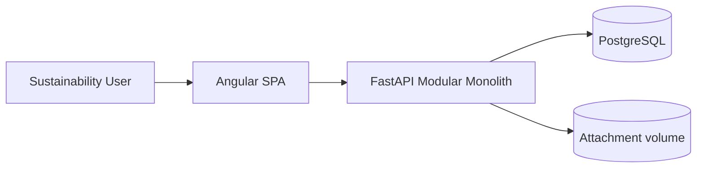
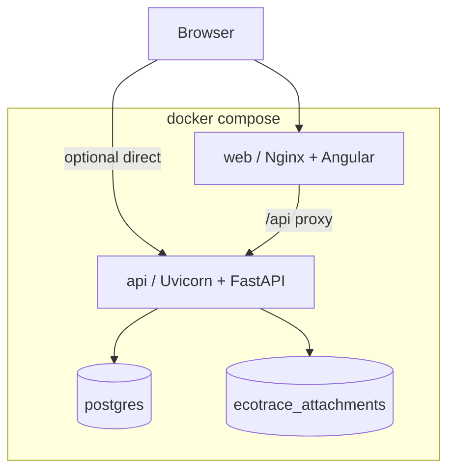
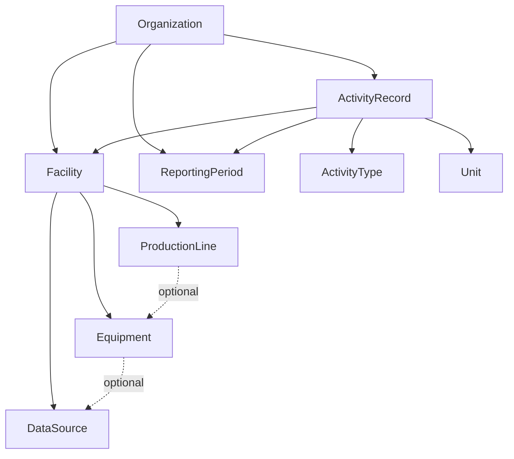
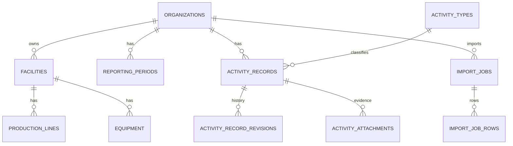
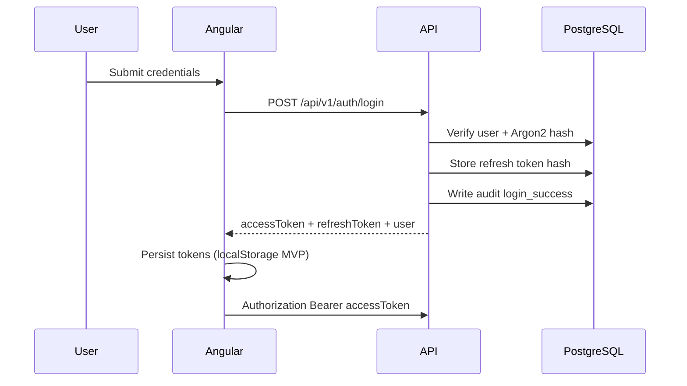
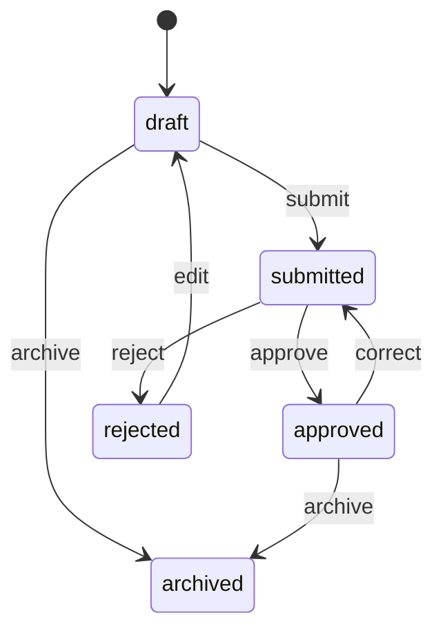
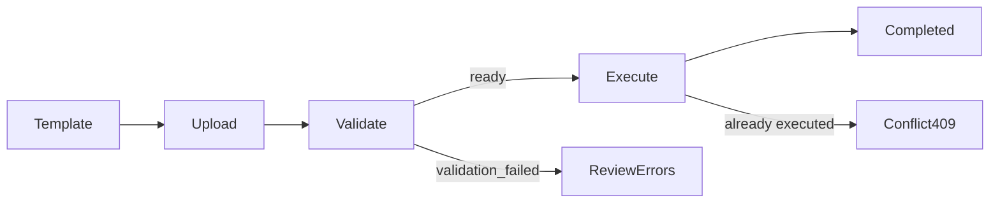
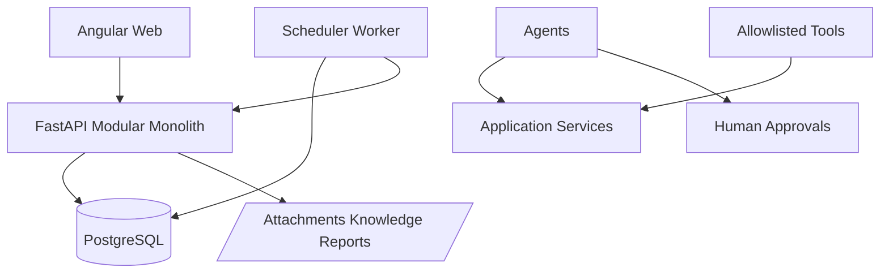

# Architecture — EcoTrace AI (v0.3.0)

## System context

EcoTrace AI provides authenticated users with organization-scoped operational sustainability data and deterministic carbon accounting through a browser SPA and a versioned HTTP API backed by PostgreSQL. Carbon accounting adds emission factors, matching, inventories, and Decimal calculation snapshots — without AI/LCA/IoT.



## Container architecture



## Backend module boundaries

```text
ecotrace/
  api/                 # presentation adapters (routers, middleware, dependencies)
  core/                # config, security, logging, database, exceptions
  shared/              # cross-cutting schemas, audit, org access helpers
  modules/
    identity/          # users, roles, tokens, auth use cases
    organizations/     # organizations + memberships
    facilities/        # facility master data
    operational_assets/# production lines, equipment, data sources
    reference_data/    # units + activity types
    reporting_periods/ # period lifecycle + lock rules
    activity_data/     # activity records, revisions, attachments
    data_imports/      # CSV import jobs
  db/                  # Alembic + seed
```

Carbon accounting carbon modules plug in beside these without redesigning activity records.

## Facility hierarchy



## Activity data model



## Frontend module boundaries

- `core/` — auth, guards, interceptors, typed API services, models
- `features/` — auth, dashboard, organizations, facilities, production-lines, equipment, data-sources, reporting-periods, activity-data, data-imports, reference-data, profile
- `layout/` — authenticated shell with role-aware navigation
- lazy-loaded routes for feature isolation

## Authentication flow



## Multi-organization isolation

- Every Operations business record belongs to an organization directly or via hierarchy.
- Repository queries include organization scope.
- Unauthorized cross-organization access returns **404** (existence hidden), matching Foundation.

## Activity record state transitions



## CSV import flow



## Non-goals

AI copilots, RAG, full LCA/PCF, Digital Product Passport, IoT/MQTT/Kafka ingestion, market-based Scope 2 evidence models, spend-based Scope 3, Redis/Celery workers, and executive dashboards.

See [carbon-accounting.md](carbon-accounting.md) for calculation methodology, matching precedence, and snapshot design.

## Phase 7 extensions

Additional modules: agents, automation, job_execution, anomaly_detection, forecasting, data_quality, alerts, notifications, scheduled_reports, supplier_monitoring, regulatory_intelligence, production_operations.



Agent execution: prompt → injection check → allowlisted tools → read results or pending approvals → audited rationale (no hidden CoT).
