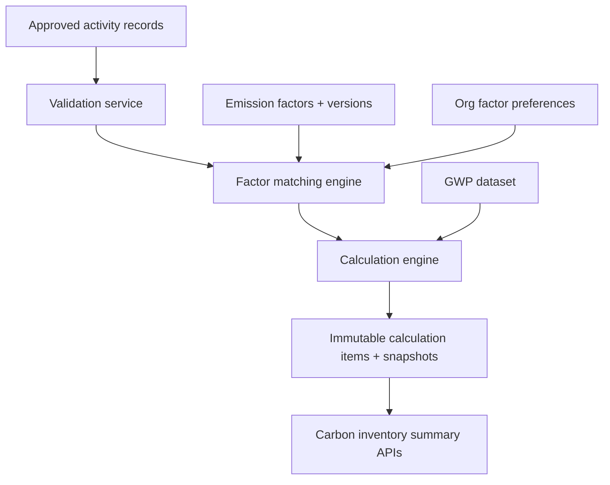
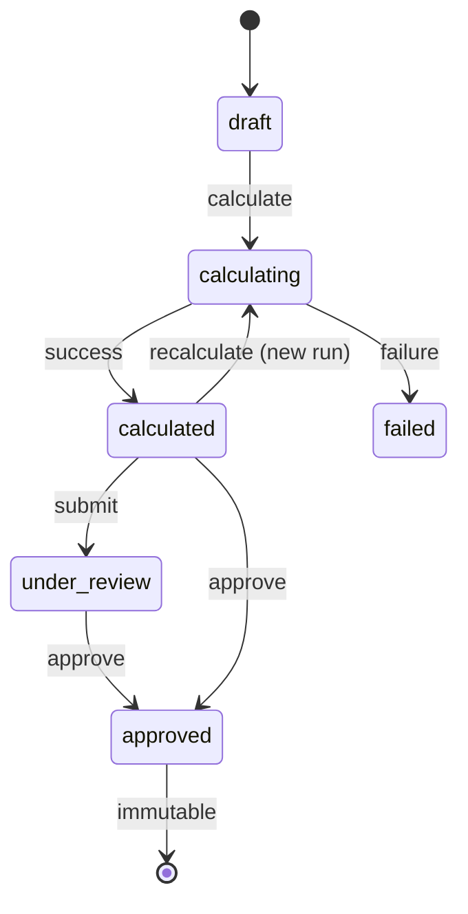

# Carbon Accounting and Emission Calculation Engine

EcoTrace AI includes a **deterministic, Decimal-based, auditable** carbon accounting engine on top of operational activity data.

## Architecture



Modules:

- `emission_factors` — sources, factors, preferences, CSV import, GWP
- `carbon_accounting` — matching + Decimal math (no I/O side effects in math helpers)
- `carbon_inventory` — inventories, runs, items, workflow

Business logic lives in application services, not API routers or Angular components.

## Calculation methodology

Canonical formula:

`CO2e = Activity Quantity × Emission Factor`

- Internal unit: **kgCO2e**
- Reporting helper: **tCO2e = kgCO2e / 1000**
- Arithmetic: Python `Decimal` only (no float)
- Stored kg values quantized to **8 decimal places** (`ROUND_HALF_UP`)
- Reported tonnes quantized to **6 decimal places** at response boundaries
- Engine version: `3.0.0`
- Methodology version: `ecotrace-v1`

### Direct aggregate factor

`totalKgCO2e = normalizedQuantity × factorValue`

### Gas-specific pathway

```
co2Kg = qty × co2Factor
ch4Kg = qty × ch4Factor
n2oKg = qty × n2oFactor
totalKgCO2e = co2Kg + ch4Kg×GWP_CH4 + n2oKg×GWP_N2O + otherGasCO2e
```

Biogenic CO2 is stored separately and is **not** merged into fossil CO2e totals.

## Scope mapping

| Scope | Categories |
|-------|------------|
| Scope 1 | stationary_combustion, mobile_combustion, fugitive_emissions, process_emissions |
| Scope 2 | purchased_electricity, purchased_steam, purchased_heat, purchased_cooling (location-based) |
| Scope 3 (initial) | purchased goods, capital goods, fuel/energy related, upstream/downstream transport, waste, business travel, commuting |

Scope is taken from the matched emission factor (not manually entered on activity records).

## Factor matching precedence

1. Organization-approved preference (compatible activity type + validity)
2. Activity type + geography + technology/fuel/mode
3. Activity type + geography (region/grid)
4. Activity type + country
5. Activity type + GLOBAL
6. No match

Equal priority candidates → **ambiguity error** (no silent selection).

Preview: `POST /api/v1/organizations/{id}/factor-matching/preview`

## Factor versioning

- Draft: editable
- Active: immutable values
- Activate may supersede prior active version of same code
- Overlapping active dimensions blocked
- Clone-version creates next draft
- Used factors are never hard-deleted

## GWP handling

Table `gwp_values` seeded as **AR5-demo** (illustrative reference, not an official IPCC distribution).

Snapshots store the GWP map used for each run/item.

## Inventory workflow



- Default: only **approved** activity records
- Blocking validation errors prevent full calculation unless `partialCalculation=true`
- Partial inventories cannot be approved while errors remain
- Recalculation creates a new run (or new inventory version if previously approved)
- Completed items are immutable

## Snapshot design

Each calculation item stores:

- factor id/code/version/source provenance
- quantity + unit conversions
- GWP values
- matching priority/reason
- human-readable formula
- engine/methodology versions
- demo disclaimer when applicable

## Demo data disclaimer

All seeded emission factor sources and factors are **demo/reference data**. They are not authoritative and must not be used for regulatory reporting or certification claims.

## Known limitations

- Market-based Scope 2 (RECs/GOs/PPAs) not implemented
- Spend-based Scope 3 not implemented
- Synchronous calculation only (no Celery/Redis)
- No AI / LCA / DPP / IoT yet

## Dashboard readiness

Summary APIs expose scope/category/facility/activity-type/GHG totals for future dashboards without embedding analytics UI here.
