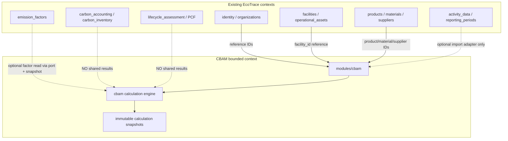

# CBAM / SKDM — Bounded Context (Specification)

**Status:** Phase 7 final audit complete — **READY_FOR_DOMAIN_VALIDATION** (no official CBAM workbook / regulatory submission / CN)

| Field | Value |
|-------|--------|
| Code namespace | `cbam` |
| UI label (TR) | SKDM |
| Backend | `apps/api/src/ecotrace/modules/cbam/` |
| Frontend | `apps/web/src/app/features/cbam/` |
| Phase 1 route | `GET /api/v1/cbam/organizations/{organizationId}/module-status` |
| Phase 2 routes | `/installations`, `/reporting-period-bindings`, `/product-profile-versions` |
| Phase 3 routes | production/activity/purchased-input records + catalogs |
| Phase 4A routes | allocation rules / allocate / allocation results |
| Phase 4B routes | reference sources / factor definitions / values / resolutions |
| Phase 5 routes | calculation definitions / runs / execute / results / recalculate |
| Phase 6 routes | export-templates, export-readiness, exports, artifacts/download, summary |
| Phase 7 | Final MVP audit / hardening / release readiness (no new business capability) |

This document set defines an isolated CBAM/SKDM bounded context inside the existing modular monolith without relabeling corporate carbon accounting, LCA, or PCF as CBAM.

## Implementation status (Phase 7)

| Area | Status |
|------|--------|
| Phase 2–6 MVP workflow | Implemented + audited |
| Migrations `0008`–`0013` | Validated |
| Release classification | **READY_FOR_DOMAIN_VALIDATION** |
| Official CBAM workbook mapping / regulatory submission | **BLOCKED** |
| Full regulatory CBAM framework / GWP invent / CN / shipment / evidence / certificate liability | **Not implemented** (blocked) |
| Automatic IPCC/DEFRA/EPA import | **Not implemented** (blocked) |
| Idempotency store (D-040) | **BLOCKED_DECISION** — deferred |

## Non-goals (still apply)

- No invented CN codes, production routes, emission factors, or regulatory formulas
- No reuse of LCA/PCF/Scope engines as CBAM calculation results
- No columns added to generic `facilities` / `products` / `reporting_periods`

## Document index

| Document | Purpose |
|----------|---------|
| [cbam/ownership.md](cbam/ownership.md) | Context ownership matrix |
| [cbam/domain-model.md](cbam/domain-model.md) | Domain aggregates and entities |
| [cbam/context-boundaries.md](cbam/context-boundaries.md) | Integration with existing modules |
| [cbam/calculation-architecture.md](cbam/calculation-architecture.md) | Separate calculation engine boundaries |
| [cbam/workflows.md](cbam/workflows.md) | Lifecycles, permissions, SoD |
| [cbam/api-boundaries.md](cbam/api-boundaries.md) | `/api/v1/cbam` resource proposal |
| [cbam/frontend-feature-map.md](cbam/frontend-feature-map.md) | Angular feature map |
| [cbam/implementation-roadmap.md](cbam/implementation-roadmap.md) | Dependency-ordered phases |
| [cbam/phase-3-data-collection.md](cbam/phase-3-data-collection.md) | Phase 3 data-collection overview |
| [cbam/phase-4a-allocation.md](cbam/phase-4a-allocation.md) | Phase 4A allocation overview |
| [cbam/phase-4a-implementation-report.md](cbam/phase-4a-implementation-report.md) | Phase 4A verification report |
| [cbam/phase-4b-factor-resolution.md](cbam/phase-4b-factor-resolution.md) | Phase 4B factor resolution overview |
| [cbam/factor-model.md](cbam/factor-model.md) | Factor/property domain model |
| [cbam/primary-data-precedence.md](cbam/primary-data-precedence.md) | Primary vs default precedence |
| [cbam/factor-resolution-rules.md](cbam/factor-resolution-rules.md) | Resolution rules |
| [cbam/factor-resolution-limitations.md](cbam/factor-resolution-limitations.md) | Explicit non-goals |
| [cbam/phase-4b-implementation-report.md](cbam/phase-4b-implementation-report.md) | Phase 4B verification report |
| [cbam/phase-5-calculation.md](cbam/phase-5-calculation.md) | Phase 5 minimal calculation overview |
| [cbam/calculation-model.md](cbam/calculation-model.md) | Calculation run/result model |
| [cbam/calculation-formulas.md](cbam/calculation-formulas.md) | Supported formulas |
| [cbam/calculation-unit-rules.md](cbam/calculation-unit-rules.md) | Unit compatibility rules |
| [cbam/calculation-limitations.md](cbam/calculation-limitations.md) | Explicit non-goals |
| [cbam/phase-5-implementation-report.md](cbam/phase-5-implementation-report.md) | Phase 5 verification report |
| [cbam/phase-6-excel-reporting.md](cbam/phase-6-excel-reporting.md) | Phase 6 Excel/reporting overview |
| [cbam/excel-template-model.md](cbam/excel-template-model.md) | Export template model |
| [cbam/excel-mapping.md](cbam/excel-mapping.md) | Mapping rules |
| [cbam/export-readiness.md](cbam/export-readiness.md) | Readiness checklist |
| [cbam/export-traceability.md](cbam/export-traceability.md) | Manifest / audit |
| [cbam/internal-skdm-template.md](cbam/internal-skdm-template.md) | Internal workbook |
| [cbam/reporting-limitations.md](cbam/reporting-limitations.md) | Explicit non-goals |
| [cbam/phase-6-implementation-report.md](cbam/phase-6-implementation-report.md) | Phase 6 verification report |
| [cbam/current-scope.md](cbam/current-scope.md) | Frozen MVP scope |
| [cbam/mvp-workflow.md](cbam/mvp-workflow.md) | End-user workflow |
| [cbam/mvp-limitations.md](cbam/mvp-limitations.md) | Accepted limitations |
| [cbam/domain-expert-open-questions.md](cbam/domain-expert-open-questions.md) | Open expert questions |
| [cbam/release-readiness.md](cbam/release-readiness.md) | Release classification |
| [cbam/phase-7-final-audit-report.md](cbam/phase-7-final-audit-report.md) | Phase 7 audit report |
| [cbam/allocation-model.md](cbam/allocation-model.md) | Allocation rule/result model |
| [cbam/allocation-methods.md](cbam/allocation-methods.md) | Supported allocation methods |
| [cbam/allocation-limitations.md](cbam/allocation-limitations.md) | Explicit non-goals |
| [cbam/activity-data-model.md](cbam/activity-data-model.md) | Activity/production/purchased model |
| [cbam/primary-vs-default-data.md](cbam/primary-vs-default-data.md) | Source-type semantics |
| [cbam/purchased-inputs.md](cbam/purchased-inputs.md) | Purchased vs consumed |
| [cbam/blocked-allocation-decisions.md](cbam/blocked-allocation-decisions.md) | Remaining allocation blockers |
| [cbam/blocked-calculation-decisions.md](cbam/blocked-calculation-decisions.md) | Calculation/factor blockers |
| [cbam/domain-decisions.md](cbam/domain-decisions.md) | Expert decision register |
| [adr/0001-isolated-cbam-bounded-context.md](adr/0001-isolated-cbam-bounded-context.md) | ADR: isolated context |
| [adr/0002-separate-cbam-calculation-engine.md](adr/0002-separate-cbam-calculation-engine.md) | ADR: separate engine |
| [adr/0003-cbam-snapshot-based-reproducibility.md](adr/0003-cbam-snapshot-based-reproducibility.md) | ADR: snapshots |
| [adr/0004-cbam-composition-over-polluting-generic-models.md](adr/0004-cbam-composition-over-polluting-generic-models.md) | ADR: composition |

## Architectural stance

## Naming

| Layer | Convention |
|-------|------------|
| Source / DB / API | `cbam` |
| Turkish UI copy | SKDM where user-facing |
| Tables (proposed) | `cbam_*` |
| Routes (proposed) | `/api/v1/cbam/organizations/{organizationId}/...` (bounded-context-first exception; see api-conventions) |
| Canonical activity entity | `CbamActivityRecord` / `cbam_activity_records` / API `activity-records` |

## Key architectural rules (post-review)

- CBAM lock owned by `CbamReportingPeriodBinding` (generic ReportingPeriod lock is not source of truth).
- Processes/routes are **installation-scoped**; periods reference/snapshot only.
- Product classifications are **temporal versions** (not a permanent unique `(org, product)` only).
- Calculation status `blocked` + detail code `BLOCKED_DOMAIN` (never a lifecycle state named BLOCKED_DOMAIN).
- Inventory receipt ≠ process consumption; engine blocks when required consumption is missing.
- No reuse of carbon/LCA/PCF engines or their ORM models inside `modules/cbam`.
- No claim of an existing shared attachment port or existing spreadsheet-formula sanitization.

## Convention conflicts noted

See [cbam/context-boundaries.md](cbam/context-boundaries.md#convention-conflicts) and [api-conventions.md](api-conventions.md).

## Related existing docs

- [architecture.md](architecture.md)
- [carbon-accounting.md](carbon-accounting.md) — corporate GHG; **not** CBAM
- [lca-pcf-dpp.md](lca-pcf-dpp.md) — product LCA/PCF; **not** CBAM
- [api-conventions.md](api-conventions.md)
