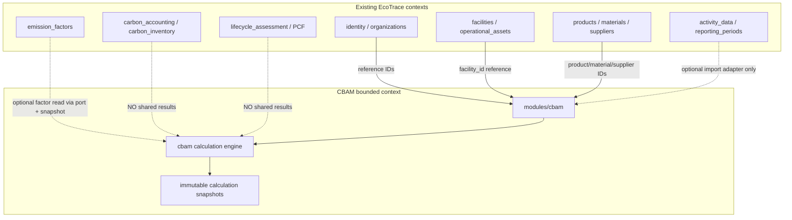

# CBAM / SKDM — Bounded Context (Specification)

**Status:** Phase 1 foundation implemented — **no CBAM domain calculation**

| Field | Value |
|-------|--------|
| Code namespace | `cbam` |
| UI label (TR) | SKDM |
| Backend | `apps/api/src/ecotrace/modules/cbam/` |
| Frontend | `apps/web/src/app/features/cbam/` |
| Phase 1 route | `GET /api/v1/cbam/organizations/{organizationId}/module-status` |

This document set defines an isolated CBAM/SKDM bounded context inside the existing modular monolith without relabeling corporate carbon accounting, LCA, or PCF as CBAM.

## Implementation status (Phase 1)

| Area | Status |
|------|--------|
| Module package + router registration | Implemented |
| Permission vocabulary + org-scoped helpers | Implemented (baseline roles; no declarant/verifier) |
| Architecture forbidden-import test | Implemented |
| Angular SKDM shell + nav | Implemented |
| Domain entities / migrations / calculations | **Not implemented** |
| Idempotency store (D-040) | **BLOCKED_DECISION** — not implemented in Phase 1 |

## Non-goals (still apply)

- No invented CN codes, production routes, emission factors, or regulatory formulas
- No reuse of LCA/PCF/Scope engines as CBAM calculation results
- No domain tables or Alembic migrations in Phase 1

## Document index

| Document | Purpose |
|----------|---------|
| [cbam/ownership.md](cbam/ownership.md) | Context ownership matrix |
| [cbam/domain-model.md](cbam/domain-model.md) | Domain aggregates and entities |
| [cbam/context-boundaries.md](cbam/context-boundaries.md) | Integration with existing modules |
| [cbam/calculation-architecture.md](cbam/calculation-architecture.md) | Separate calculation engine boundaries |
| [cbam/workflows.md](cbam/workflows.md) | Lifecycles, permissions, SoD |
| [cbam/api-boundaries.md](cbam/api-boundaries.md) | `/api/v1/cbam` resource proposal |
| [cbam/frontend-feature-map.md](cbam/frontend-feature-map.md) | Angular feature map |
| [cbam/implementation-roadmap.md](cbam/implementation-roadmap.md) | Dependency-ordered phases |
| [cbam/domain-decisions.md](cbam/domain-decisions.md) | Expert decision register |
| [adr/0001-isolated-cbam-bounded-context.md](adr/0001-isolated-cbam-bounded-context.md) | ADR: isolated context |
| [adr/0002-separate-cbam-calculation-engine.md](adr/0002-separate-cbam-calculation-engine.md) | ADR: separate engine |
| [adr/0003-cbam-snapshot-based-reproducibility.md](adr/0003-cbam-snapshot-based-reproducibility.md) | ADR: snapshots |
| [adr/0004-cbam-composition-over-polluting-generic-models.md](adr/0004-cbam-composition-over-polluting-generic-models.md) | ADR: composition |

## Architectural stance

## Naming

| Layer | Convention |
|-------|------------|
| Source / DB / API | `cbam` |
| Turkish UI copy | SKDM where user-facing |
| Tables (proposed) | `cbam_*` |
| Routes (proposed) | `/api/v1/cbam/organizations/{organizationId}/...` (bounded-context-first exception; see api-conventions) |
| Canonical activity entity | `CbamActivityRecord` / `cbam_activity_records` / API `activity-records` |

## Key architectural rules (post-review)

- CBAM lock owned by `CbamReportingPeriodBinding` (generic ReportingPeriod lock is not source of truth).
- Processes/routes are **installation-scoped**; periods reference/snapshot only.
- Product classifications are **temporal versions** (not a permanent unique `(org, product)` only).
- Calculation status `blocked` + detail code `BLOCKED_DOMAIN` (never a lifecycle state named BLOCKED_DOMAIN).
- Inventory receipt ≠ process consumption; engine blocks when required consumption is missing.
- No reuse of carbon/LCA/PCF engines or their ORM models inside `modules/cbam`.
- No claim of an existing shared attachment port or existing spreadsheet-formula sanitization.

## Convention conflicts noted

See [cbam/context-boundaries.md](cbam/context-boundaries.md#convention-conflicts) and [api-conventions.md](api-conventions.md).

## Related existing docs

- [architecture.md](architecture.md)
- [carbon-accounting.md](carbon-accounting.md) — corporate GHG; **not** CBAM
- [lca-pcf-dpp.md](lca-pcf-dpp.md) — product LCA/PCF; **not** CBAM
- [api-conventions.md](api-conventions.md)
