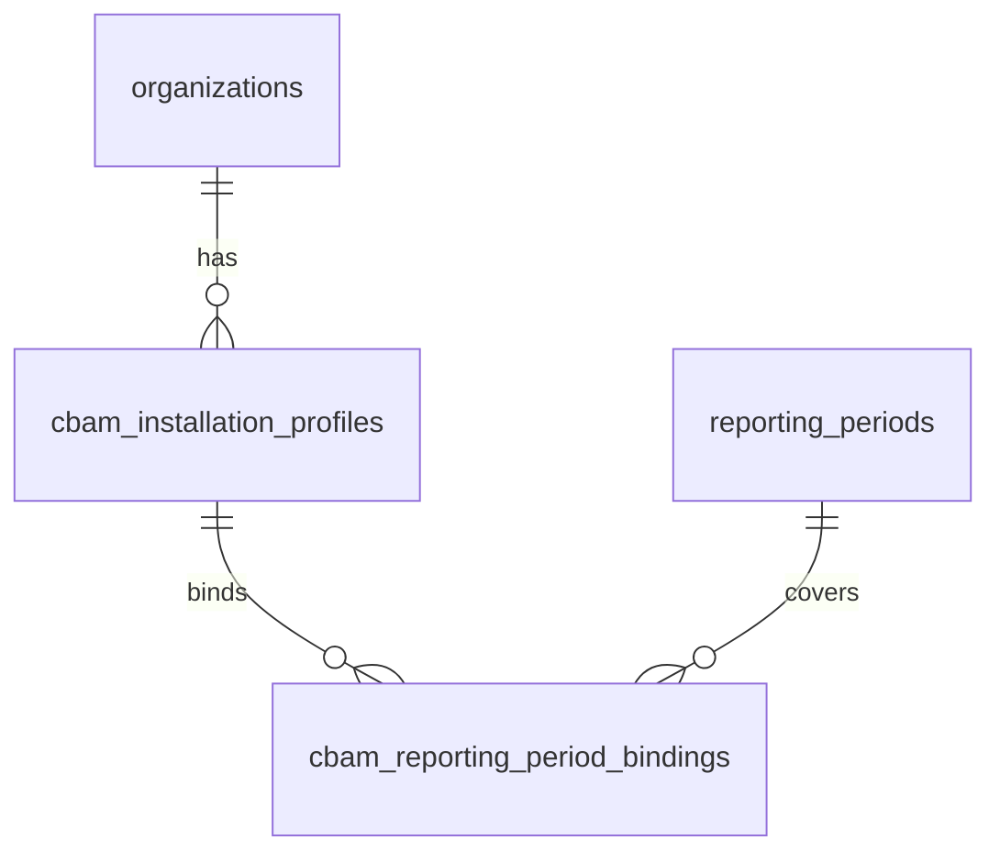
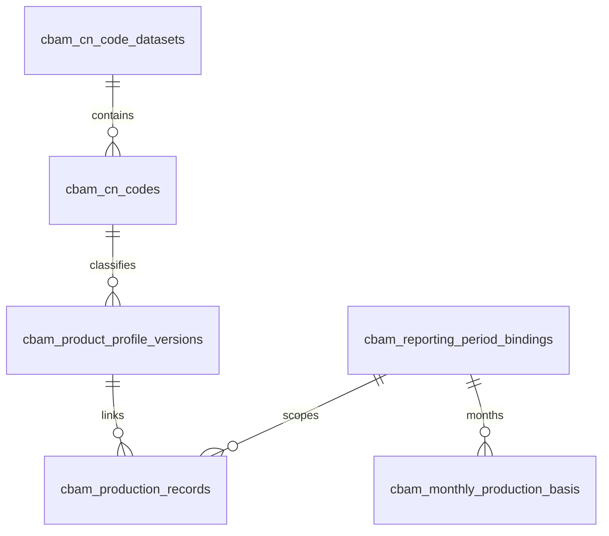
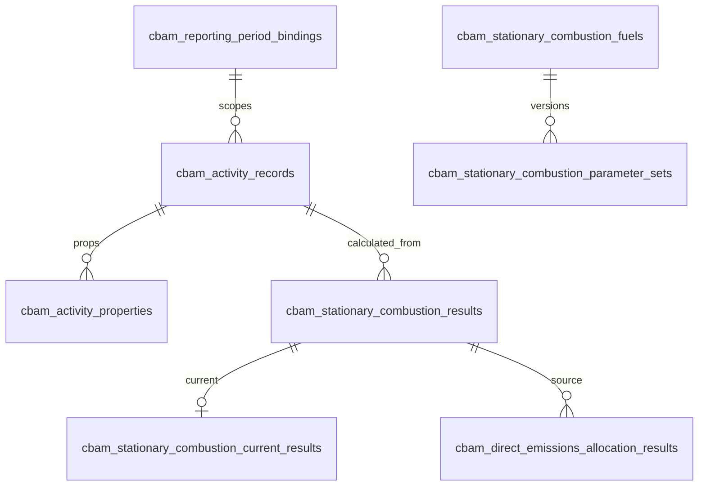
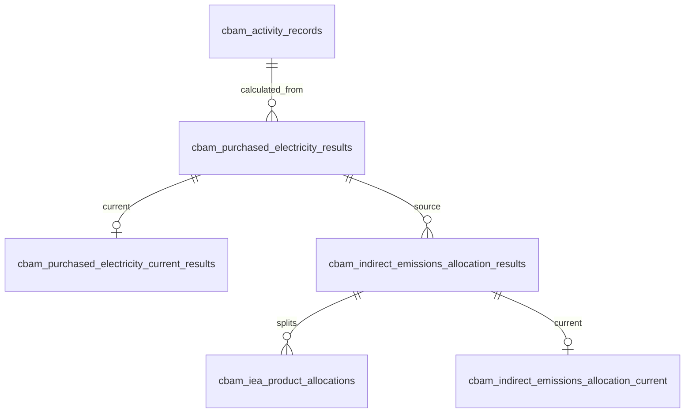
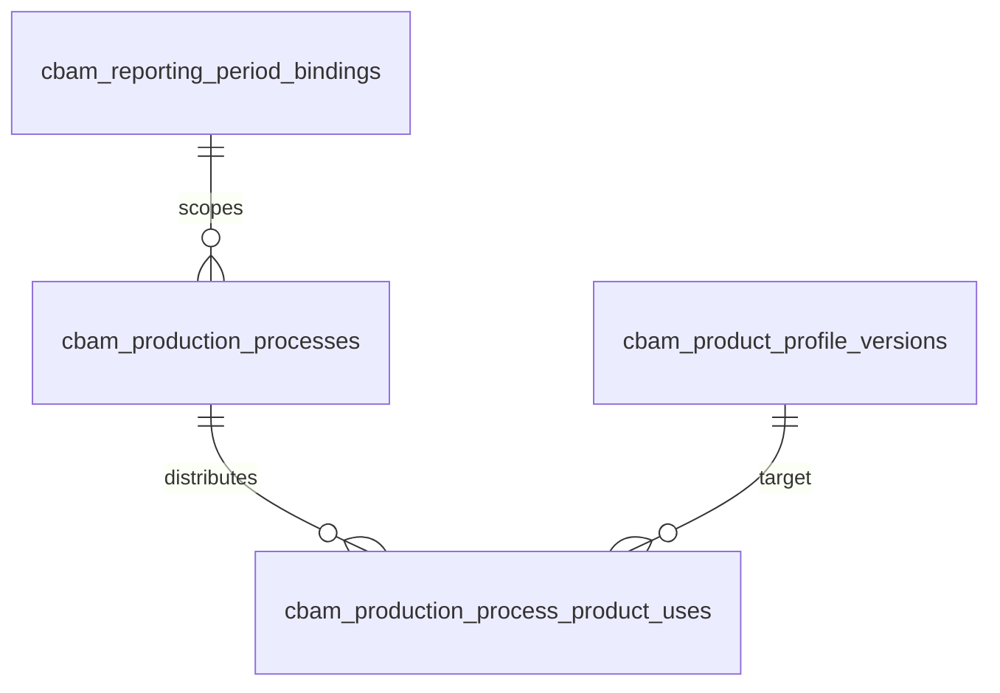
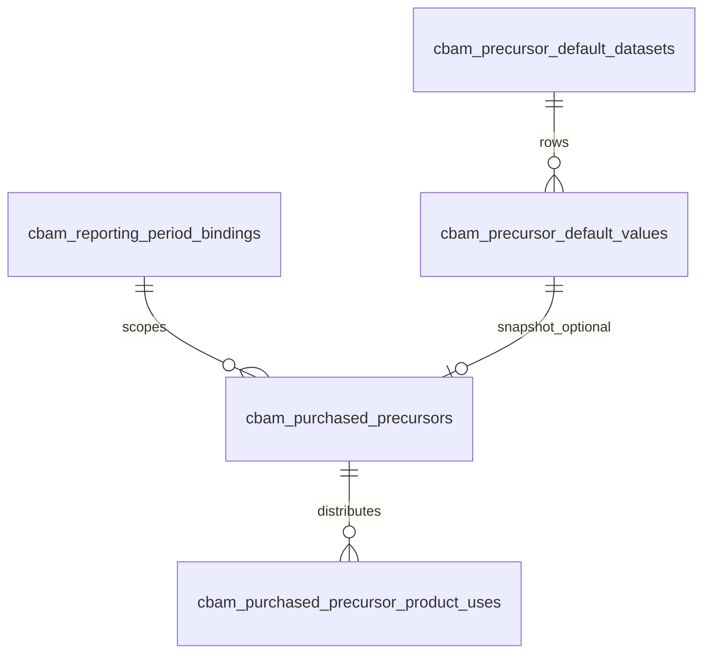
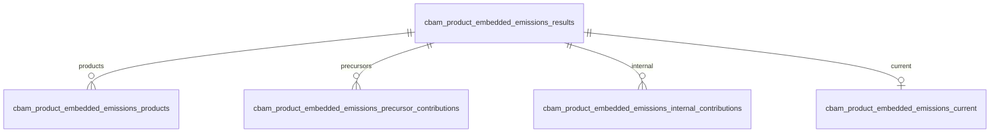
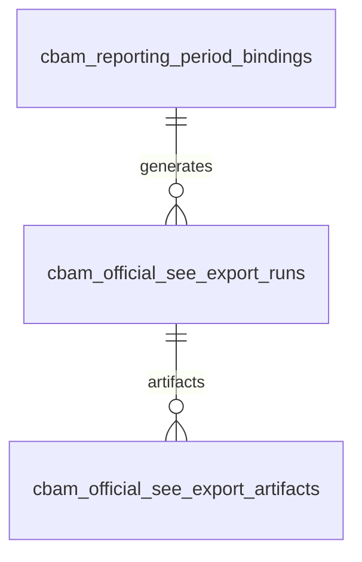

# Data Relationships and Lifecycle (CBAM / SKDM)

Exact table names from `modules/cbam/infrastructure/models.py` (53 tables).  
**Migration head:** `0032_cbam_prec_audit`.  
**Includes:** PEE V2 result graph, purchased precursors, DEA/IEA allocation, Official SEE export runs/artifacts.  
**Ops note:** Official SEE recalculation needs LibreOffice **26.8** on the API host. The supported Docker API image ships TDF LibreOffice 26.8 (not Debian 7.4).

## 1. Tenant and period

- **Ownership:** installation and binding are organization-scoped.  
- **Archive:** installation/binding archive blocks new writes; historical rows remain readable.  
- **Delete:** hard deletes are not the normal UI path; archive is.

## 2. Product classification and production

- Production requires classification-ready profile for new writes.  
- Profile supersede/archive → production link status may become OUTDATED while old FK remains.

## 3. Activities and direct emissions

- Results are immutable snapshots.  
- Current pointer table holds the active result id per key.  
- DEA stores monthly/source/product snapshot tables (`cbam_dea_*`).

## 4. Electricity and indirect emissions

- Exported electricity fields are snapshotted separately and not used as a subtraction from purchased electricity in PE calculation.

## 5. Processes and internal flows

- Cardinality: one process → many uses.  
- Balance: sum(uses)+non-CBAM must equal produced quantity for readiness (exact Decimal).  
- Internal-use edges feed PEE V2 internal contributions.

## 6. Purchased precursors

- Modes: `SUPPLIER_DATA` | `EU_DEFAULT` only.  
- Default selection stores immutable snapshot columns on the precursor row.

## 7. Product embedded emissions

- Combines DEA + IEA + process heat/waste gas + precursors + internal flows + process exported electricity (V2).  
- Current pointer per methodology/binding.

## 8. Official Excel

- Artifact rows exist only after validation success.  
- Download is authenticated and organization-scoped.

## 9. Generic factor / calculation / internal export

| Table group | Tables | Role |
|-------------|--------|------|
| Factors | `cbam_reference_sources`, `cbam_factor_definitions`, `cbam_factor_values`, `cbam_factor_resolutions` | Resolve primary/default factors |
| Calculation | `cbam_calculation_definitions`, `cbam_calculation_runs`, `cbam_calculation_results` | Generic multiply formula |
| Internal export | `cbam_export_templates`, `cbam_export_mappings`, `cbam_export_runs`, `cbam_export_artifacts` | Internal SKDM Excel |
| Purchased inputs (generic) | `cbam_purchased_input_records` | Generic purchased rows |
| Allocation rules (generic) | `cbam_allocation_rules`, `cbam_allocation_results` | Legacy/generic allocation |

## 10. Table dictionary (compact)

| Table | Purpose | Mutable? | Current pointer? |
|-------|---------|----------|------------------|
| `cbam_installation_profiles` | Site master | Yes (archive) | No |
| `cbam_reporting_period_bindings` | Period scope | Yes (status) | No |
| `cbam_cn_*` | CN catalog | Seed/reference | No |
| `cbam_product_profile_versions` | Classification | Draft/publish/archive | No |
| `cbam_production_records` | Production input | Yes/archive | No |
| `cbam_monthly_production_basis` | D/E months | Yes | No |
| `cbam_activity_records` / `_properties` | Activity input | Yes/archive | No |
| `cbam_stationary_combustion_*` | Fuel catalog + SC results | Catalog seed; results immutable | Yes (`_current_results`) |
| `cbam_direct_emissions_allocation_*` / `cbam_dea_*` | DEA | Results immutable | Yes |
| `cbam_purchased_electricity_*` | PE results | Immutable | Yes |
| `cbam_indirect_emissions_allocation_*` / `cbam_iea_*` | IEA | Immutable | Yes |
| `cbam_production_processes` / `_product_uses` | Processes | Draft/archive | No |
| `cbam_precursor_default_*` | EU DV catalog | Seed | No |
| `cbam_purchased_precursors` / `_product_uses` | Precursors | Draft/archive | No |
| `cbam_product_embedded_emissions_*` | PEE | Immutable | Yes |
| `cbam_official_see_export_*` | Official Excel | Runs/artifacts append-only | No |
| Factor/calc/export/generic allocation tables | Internal path | Mixed | No |

Primary keys are UUID `id` columns unless noted in migrations. Audit fields `created_at` / `updated_at` / user FKs appear on mutable entities. Optimistic concurrency uses `row_version` where exposed as `rowVersion` in APIs.

## 11. Lifecycle summary

1. **Enter** masters (installation, binding, profiles).  
2. **Enter** inputs (production, D/E, activities, processes, precursors).  
3. **Calculate** SC → PE → DEA → IEA → PEE (order soft-enforced by readiness).  
4. **Export** Official SEE only from validated current PEE.  
5. **Preserve** history; move current pointers; mark stale instead of rewriting snapshots.
