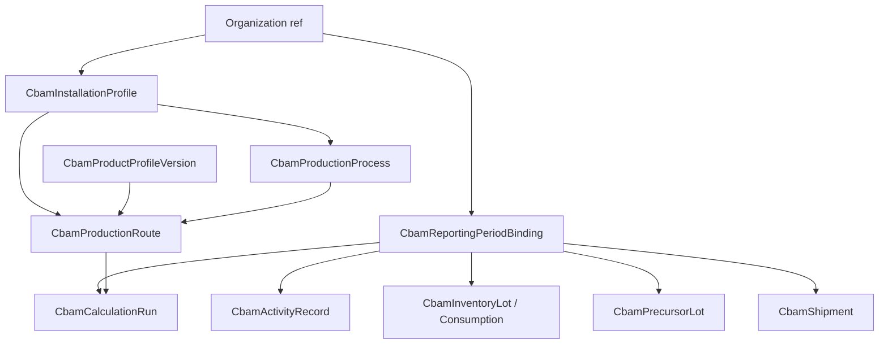

# CBAM Domain Model (Implementation-Independent)

No regulatory catalog values, CN lists, factors, or formulas are defined here. Fields marked **TBD_EXPERT** / decisions in [domain-decisions.md](domain-decisions.md) remain blocked.

## Conventions

- Tenant root: `organization_id` on every org-scoped aggregate
- Stable IDs: UUID primary keys
- Soft archive preferred over hard delete for master data; hard delete forbidden after inclusion in an approved/locked calculation snapshot
- Optimistic concurrency: `row_version` (integer) on mutable aggregates
- Provenance enum (conceptual): `actual` | `default` | `alternative_default` | `unknown` — usage rules D-011
- Calculation-run lifecycle status values never include `BLOCKED_DOMAIN` (that is a **blocking detail code** only; see workflows / calculation architecture)
- Canonical activity entity name: **`CbamActivityRecord`** (table concept `cbam_activity_records`; API `activity-records`)

## Aggregate map

---

## 1. CBAM installation profile

| Item | Definition |
|------|------------|
| Purpose | CBAM-specific configuration for a manufacturing site, without altering `facilities` |
| Aggregate root | `CbamInstallationProfile` |
| Stable ID | UUID |
| Tenant | `organization_id` |
| Important fields | `facility_id` (ref), `code`, `name`, `status`, `operator_identity_ref` (TBD_EXPERT), `timezone`, `row_version`, metadata |
| Relationships | References one `facility_id` under **pilot constraint** (D-041): at most one **active** profile per Facility until D-041 resolves otherwise. Multi-facility spanning installations out of scope until D-041. |
| Lifecycle | `draft` → `active` → `archived` |
| Invariants | facility must belong to same org; unique `(organization_id, code)`; cardinality per D-041 |
| Immutability | identity fields frozen after first approved/locked calculation referencing profile (snapshot still captures values) |
| Deletion | archive only |

## 2. Reporting period binding and CBAM lock ownership

| Item | Definition |
|------|------------|
| Purpose | Bind a generic `reporting_periods` row to **CBAM-owned** workflow and lock state |
| Aggregate root | `CbamReportingPeriodBinding` |
| Fields | `reporting_period_id`, CBAM `status`, `locked_at`, `locked_by_user_id`, `approved_at`, `approved_calculation_run_id` (nullable until D-030 allows activation), `revision_number`, `row_version` |
| Invariants | one binding per `(organization_id, reporting_period_id)` |

### Lock ownership rules (canonical — F-01)

1. **`CbamReportingPeriodBinding` owns** the CBAM workflow state and CBAM lock state.
2. Generic `ReportingPeriod.lock` is **not** the source of truth for CBAM locking.
3. Generic `ReportingPeriod` may be checked as an **optional additional guard** only.
4. Locking or unlocking a generic `ReportingPeriod` must **not** automatically lock or unlock a CBAM binding.
5. A locked CBAM binding remains immutable independently of generic period state.
6. A CBAM correction after lock/approval must create a **CBAM revision** per CBAM workflow (not by mutating locked data in place).
7. Operational preference for whether operators should also lock the generic period is **D-031** (`BLOCKED_DOMAIN`).

## 3. Versioned CN-code catalog

| Item | Definition |
|------|------------|
| Aggregate root | `CbamReferenceDataVersion` containing `CbamCnCode` entries |
| Fields | `code`, `description`, `valid_from`/`valid_to`, `catalog_version_id`, `status` |
| Content | **BLOCKED_DOMAIN** — do not invent codes |
| Tenant | global/system catalog (org may pin a version) |
| Immutability | published catalog version immutable |

## 4. Aggregated goods category

Within reference data version: `CbamAggregatedGoodsCategory` (`category_code`, `name`, linked CN set TBD_EXPERT, default functional unit ref). Content **BLOCKED_DOMAIN**.

## 5. CBAM product profile (temporal / versioned)

| Item | Definition |
|------|------------|
| Purpose | Associate EcoTrace `product` with CN/AGC/FU **over time** without altering `products` |
| Aggregate root | `CbamProductProfile` (logical) with versioned rows `CbamProductProfileVersion` |
| Important fields (per version) | `product_id`, `version`, `cn_code_id`, `aggregated_goods_category_id`, `functional_unit` (VO), `complexity` (`simple`\|`complex` TBD_EXPERT), `reference_catalog_version_id`, `valid_from`, `valid_to` (nullable open-ended), `status` (`draft`\|`active`\|`superseded`\|`archived`), `row_version` |
| Structural support | One generic Product may have **multiple historical** CBAM product-profile versions; CN and AGC may change over time; route applicability may change via versioned associations; non-overlapping effective periods for the same product’s active classifications; historical classifications become immutable once used by an approved or locked calculation; calculation runs snapshot the exact classification used |
| Uniqueness | **Not** a permanent unique `(organization_id, product_id)` alone. Enforce non-overlapping `(organization_id, product_id, valid_from, valid_to)` for non-draft versions (exact overlap rules **D-029**) |
| Expert rules | Cutover/authorization for classification changes: **D-029** |

## 6–8. Production process, route, boundaries (installation-scoped)

### Ownership (canonical — F-05)

- **Production processes** are **installation-scoped** (`CbamInstallationProfile` → processes).
- **Production routes** belong to / are available for an installation’s process configuration (and may reference a product-profile version).
- **Reporting-period bindings do not own** process or route master definitions.
- Period-specific activity, production, allocation, and calculation records may **reference** process/route definitions and must **snapshot** them for calculations.

### Production process (`CbamProductionProcess`)

- Root under installation
- Fields: `code`, `name`, `process_type` (TBD_EXPERT), `status`
- Owns process boundary definition version
- Sharing across products/routes: structure allows references; business rules **D-034**

### Production route (`CbamProductionRoute`)

- Versioned route under installation linking process steps for a product-profile version
- Fields: `version`, `status` (`draft`\|`active`\|`superseded`), `valid_from`/`valid_to`, `product_profile_version_id`
- Invariant: approved/locked calculations pin `route_version_id` (and snapshotted definition)

### Process / system boundary (`CbamProcessBoundary`, `CbamSystemBoundary`)

- Owned by CBAM; **not** `LcaSystemBoundary`
- Versioned with process/route

## 9. Process input and output flows

Entity `CbamProcessFlow`: direction, `flow_kind` (`fuel`\|`material`\|`electricity`\|`heat_measurable`\|`heat_non_measurable`\|`process_emission`\|`product`\|`precursor`\|`other`), unit_code, optional material/product refs.

## 10. CBAM activity records

| Item | Definition |
|------|------------|
| Purpose | Period-scoped measured/reported quantities for CBAM processes |
| Aggregate root | **`CbamActivityRecord`** |
| Table concept | `cbam_activity_records` |
| API resource | `activity-records` |
| Frontend concept | CBAM activity records |
| Fields | period binding, installation, process/route version refs, flow ref, quantity (`Decimal`), unit, provenance, activity_date/range, status, `row_version` |
| Note | Distinct from corporate `activity_records`. The phrase “activity data” is only a business concept, not the entity name. |

### Typed payloads (on `CbamActivityRecord`)

Electricity, measurable heat, non-measurable heat, process-emission materials, production quantities — as previously; formulas TBD_EXPERT.

## 11. Inventory receipt, lot, and process consumption (F-10)

Separate structural concepts:

| Concept | Purpose |
|---------|---------|
| `CbamInventoryReceipt` | Record of material/precursor quantity received into CBAM inventory for a period/installation |
| `CbamInventoryLot` | Lot identity with `received_quantity`, `available_quantity`, `consumed_quantity`, unit, status |
| `CbamProcessConsumption` | Approved/posted consumption of a lot (or material) by a process in a period |
| `CbamInventoryReversal` / correction | Reversal or correction that **preserves history** (no silent rewrite of prior receipt/consumption) |

### Structural invariants

1. Receipt is **not** the same as consumption.
2. Emissions calculations that require material balance use **approved process consumption**, not purchase/receipt quantity alone.
3. Total consumption for a lot cannot exceed available quantity (after reversals).
4. Reversals preserve history.
5. Precursor-lot consumption must conserve quantity.
6. No fake, empty, or provisional consumption values may be invented to make a calculation appear complete.
7. If a calculation requires inventory consumption and required consumption is missing → run status `blocked` (not guessed).

Business gates and correction authorization: **D-033**. Allocation conservation tolerance: **D-032**.

## 12–16. Precursor model

| Entity | Purpose |
|--------|---------|
| `CbamPrecursorSupplierLink` | Links `supplier_id` + optional origin installation identity |
| `CbamPrecursorInstallationRef` | External/internal installation identity for precursor origin (TBD_EXPERT) |
| `CbamPrecursorLot` | Lot quantity, unit, period, product/CN, status |
| `CbamPrecursorEmbeddedEmissionDeclaration` | Declared SEE with provenance, unit per FU, validity, evidence links |
| `CbamComplexGoodsGraph` | Per product-profile version + route version + period; acyclic; max depth D-023 |

## 17–18. Allocation

| Entity | Purpose |
|--------|---------|
| `CbamAllocationRuleDefinition` | Versioned method family (TBD_EXPERT) |
| `CbamAllocationRuleApplication` | Binding to process/route/period; snapshotted into runs |

### Structural conservation (values TBD — D-032)

- Allocation applications must reconcile source quantities or emissions to allocated outputs within an **approved tolerance** (tolerance not invented here).
- Allocation totals cannot silently lose or create quantity or emissions.

## 19. Shipment and export

`CbamShipment`: period, product-profile version, quantity, unit, destination_country, customs refs (TBD_EXPERT), party refs, status.  
Core product SEE may exist without shipments; shipment-level SEE requires shipment phase (see roadmap).

## 20–21. Versioned CBAM factors and calculation rules

`CbamFactorSetVersion`, `CbamCalculationRulePackVersion` — published versions immutable; orgs pin on period binding. Content BLOCKED_DOMAIN.

## 22–23. Calculation run and steps

| Item | Definition |
|------|------------|
| Aggregate root | `CbamCalculationRun` |
| Status | Lifecycle only: `requested` \| `validating` \| `blocked` \| `calculated` \| `failed` \| `approved` \| `superseded` \| (`cancelled` retained structurally — activation **D-039**) |
| Blocking | When status=`blocked`, store blocking **detail code** (e.g. `BLOCKED_DOMAIN`), blocking decision IDs, affected rules/inputs, human-readable explanation, timestamp |
| Children | `CbamCalculationStep` |
| Immutability | completed/approved/locked-referenced runs immutable; recalculation creates new run |

### Traceability chain (F-19)

Auditor navigation must be possible:

`CbamCalculationRun` → `CbamCalculationStep` → input snapshot entry → source `CbamActivityRecord` / precursor / consumption record → `CbamEvidenceLink` → evidence checksum/version.

Steps need not duplicate all evidence IDs if the input snapshot provides an immutable direct trace.

### Unit snapshot requirements (D-037)

Snapshots preserve: source unit, normalized unit, conversion-factor value, conversion-factor version or stable definition, conversion direction, precision policy.

### Numeric precision (D-036)

Decimal only; engine version defines deterministic Decimal context; no uncontrolled float; no intermediate rounding without approved rule pack; final reporting rounding BLOCKED until expert approval; snapshots store raw normalized Decimal strings before presentation rounding.

## 24. Evidence link

`CbamEvidenceLink`: target entity type/id, storage ref (checksum, content_type, path), document_type (TBD_EXPERT), uploaded_by, created_at.

**Storage reality (F-11 / D-042):** No shared attachment-storage port exists today. Reusable pattern lives in `activity_data.attachment_service`. CBAM must not import `activity_data` ORM/internals. Choose: (1) extract approved shared evidence-storage port, or (2) CBAM-owned evidence service using the established security pattern.

## 25–28. Review, approval, lock, revision

| Entity | Purpose |
|--------|---------|
| `CbamReviewFinding` | Blocking/warning finding |
| `CbamApproval` | Approval act; may target period/run/report; period approval must be able to link **one exact** `calculation_run_id` |
| Period lock | Fields on **CBAM binding only** (see §2) |
| `CbamRevision` | Unlock/reopen with required reason |

Final production order of run approval vs period approval vs lock: **D-030** (BLOCKED_DOMAIN). Until resolved, skeleton may define states but must not activate unresolved final approval/lock transitions as production-complete.

## 29–30. Generated report and verification package

`CbamGeneratedReport`, `CbamVerificationPackage` as before. Verifier read-only access structure: **D-038**.

---

## Cross-cutting invariants

1. All quantities: `Decimal` + explicit `unit_code`
2. No silent provenance fallback
3. Approved/locked runs refuse mutation
4. Source master-data edits after snapshot must not change locked results
5. CBAM tables must not store Scope 1/2/3 inventory totals as SEE
6. Hard delete prohibited for entities referenced by calculation snapshots
7. Carbon/LCA/PCF engines and their ORM models are outside the CBAM anti-corruption boundary (see context-boundaries)
