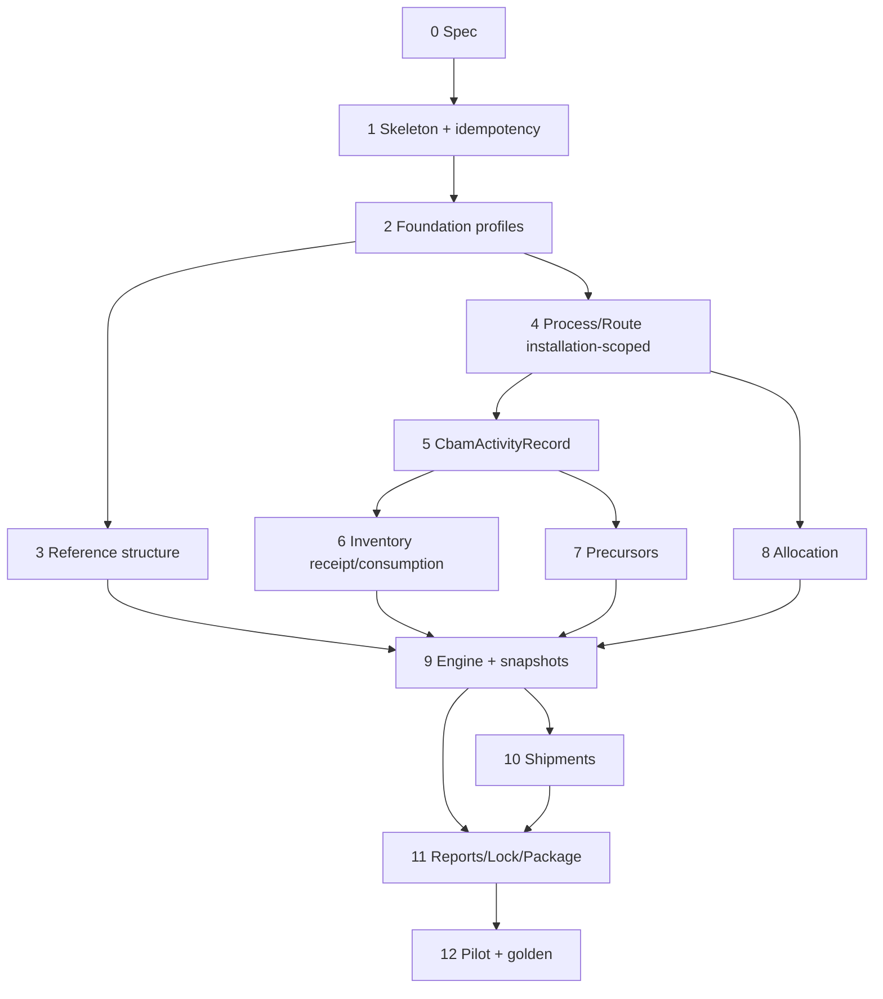

# CBAM Implementation Roadmap

Dependency-ordered phases for the existing EcoTrace modular monolith.  
Does **not** re-implement identity, tenancy, Decimal math utilities, audit, or generic period master data.

## Required dependency order (canonical)

1. CBAM skeleton and permissions  
2. Installation / product-profile versions / period bindings (+ evidence decision D-042)  
3. Reference-data structures (empty/versioned; no invented CN/AGC)  
4. Processes, routes, boundaries, and flows (**installation-scoped**)  
5. `CbamActivityRecord` activity collection  
6. Inventory receipts, lots, and process consumption  
7. Precursors and complex-goods graph  
8. Allocation rules and allocation applications  
9. Deterministic calculation engine and snapshots  
10. Shipments and shipment-level calculation  
11. Reports, approval, locking, revisions, and verification package  
12. Pilot and expert-approved golden tests  

### Calculation scope notes

- Core **product-specific** embedded-emission calculation may run **without** a shipment (phase 9 can succeed for product scope before phase 10).
- **Shipment-level** embedded emissions require phase 10.
- A calculation that **requires** inventory consumption must be **`blocked`** until consumption data exists — no fake/provisional consumption.
- Idempotency foundation (D-040) lands before the first REQUIRED operation (staged-import confirm, calculation request, report generation, verification-package generation).

---

## Phase 0 — Specification freeze

| Item | Content |
|------|---------|
| Goal | ADRs + ownership + decision register acknowledged |
| Docs | `docs/cbam/*`, `docs/adr/0001–0004` |
| Acceptance | BLOCKED_DOMAIN list known; F-* corrections applied |
| Out of scope | any code |

## Phase 1 — Module skeleton, permissions, idempotency foundation

| Item | Content |
|------|---------|
| Goal | Empty `modules/cbam`; RBAC helpers; feature flag; **idempotency-store design/skeleton** for REQUIRED ops (D-040) |
| Reusable | identity, org_access, CamelModel, audit |
| New | package layout; optional unmounted routers; idempotency table/design owned by CBAM |
| Docs | api-conventions CBAM path note |
| Tests | authz helpers; **architecture forbidden-import test** (planned) |
| Acceptance | no LCA/carbon imports; routes preferably not public until phase 2 |
| Out of scope | domain tables, calculations, inventing roles beyond baseline helpers |

### Phase 1 implementation status

| Deliverable | Status |
|-------------|--------|
| `apps/api/src/ecotrace/modules/cbam/` package | Done |
| `GET /api/v1/cbam/organizations/{organizationId}/module-status` | Done (foundation status only; not a calculation/compliance endpoint) |
| Enforced `cbam:view` + `require_cbam_view` | Done (baseline EcoTrace roles; D-019/D-038 roles not invented) |
| `require_cbam_configure` | Kept for real role-mapping denial tests; no configure HTTP endpoint |
| Future `cbam:*` vocabulary constants | Documented; other speculative helpers not shipped |
| Architecture forbidden-import test | Done (scans `modules/cbam` + `api/v1/cbam.py`; parent/relative import forms) |
| Frontend `features/cbam` SKDM shell + `/app/cbam` | Done |
| Feature flag | Not added (repository has no standard feature-flag mechanism) |
| Idempotency DB table / retention / replay (D-040) | **BLOCKED_DECISION** — deferred; no Phase 1 REQUIRED mutating op yet |
| Domain tables / migrations / calculations | Out of scope (not started) |

Later phases remain incomplete.

## Phase 2 — Foundation aggregates

**Status: Implemented (with explicit skips)**

| Item | Content |
|------|---------|
| Goal | Installation profiles (cardinality per D-041 pilot constraint), **temporal product-profile versions**, period bindings, evidence links |
| Reusable | facilities, reporting_periods, products refs (ports/adapters) |
| New | `cbam_installation_profiles`, `cbam_product_profile_versions`, `cbam_reporting_period_bindings` |
| Evidence | **Skipped** — D-042 unresolved; `cbam_evidence_links` not created |
| BE | CRUD; `draft→data_collection` only for periods; approve/lock fail-closed (D-030) |
| FE | installations + periods under SKDM; **no** product-profile / CN UI |
| Acceptance | no columns on `products`/`facilities`; CBAM lock fields on binding only |
| Out of scope | CN content, calculations, evidence |

## Phase 3 — Basic data-collection foundation (**implemented**)

> Product delivery of Phase 3 is **data-collection capture** (production / activity / purchased inputs).  
> Historical roadmap text below for “reference data versioning” remains a later catalog milestone (formerly Phase 3; still before CN content inventing).

| Item | Content |
|------|---------|
| Goal | Capture production, activity, and purchased-input quantities under period bindings |
| New | `cbam_production_records`, `cbam_activity_records`, `cbam_activity_properties`, `cbam_purchased_input_records` |
| Migration | `0009_cbam_data_collection` |
| BE | CRUD/archive; catalogs for activity types/units; no factors/calc |
| FE | Period detail tabs: Üretim / Faaliyet / Satın alınan girdiler |
| Acceptance | org isolation; primary/default/unknown; purchased≠consumed; no calculation |
| Out of scope | allocation, factors, Excel, report, CN, evidence |

## Phase 4A — Allocation foundation (**implemented**)

| Item | Content |
|------|---------|
| Goal | Explicit quantity allocation of shared activity/purchased inputs to product/installation scope |
| New | `cbam_allocation_rules`, `cbam_allocation_results` |
| Migration | `0010_cbam_allocation_foundation` |
| Methods | `DIRECT_ASSIGNMENT`, `PRODUCTION_QUANTITY_RATIO`, `MANUAL_RATIO` |
| BE | rule CRUD/activate/archive; allocate activity/purchased; recalculate; Decimal-safe math |
| FE | Period detail tab: **Alokasyon** |
| Acceptance | ratio/quantity persistence; consumed_quantity for purchased; no emission calc |
| Out of scope | emission factors, CO2e, Excel/report, CN, shipment, customer/export allocation |

## Phase 4B — Factor resolution foundation (**implemented**)

| Item | Content |
|------|---------|
| Goal | Deterministic selection of primary vs default factor/property values |
| New | `cbam_reference_sources`, `cbam_factor_definitions`, `cbam_factor_values`, `cbam_factor_resolutions` |
| Migration | `0011_cbam_factor_resolution` |
| BE | catalog CRUD for org values; resolve activity/purchased/allocation; history |
| FE | Period detail tab: **Faktörler** |
| Acceptance | precedence, ambiguity, validity, units; no emission multiplication |

## Phase 5 — Minimal calculation engine (**implemented**)

| Item | Content |
|------|---------|
| Goal | Explicit multiply of source quantity × already-resolved factor when units compatible |
| New | `cbam_calculation_definitions`, `cbam_calculation_runs`, `cbam_calculation_results` |
| Migration | `0012_cbam_minimal_calculation` |
| Formula | `MULTIPLY_ACTIVITY_BY_FACTOR` only (`multiply-activity-by-factor-v1`) |
| BE | create/execute run; persist results; partial completion; recalculate |
| FE | Period detail tab: **Hesaplama** |
| Acceptance | Decimal-safe; block unresolved/ambiguous/incompatible; no official Excel/CN |
| Out of scope | CO2e invent, automatic external factor import, official workbook, CN, shipment |

## Phase 6 — Excel mapping & SKDM summary (**implemented**)

| Item | Content |
|------|---------|
| Goal | Map Phase 5 outputs into Excel + internal SKDM period summary with traceability |
| New | `cbam_export_templates`, `cbam_export_mappings`, `cbam_export_runs`, `cbam_export_artifacts` |
| Migration | `0013_cbam_excel_export` |
| Template | Internal `ECOTRACE_SKDM_INTERNAL` only; official mapping **BLOCKED** |
| BE | readiness, workbook copy/populate, formula preservation, manifest, summary |
| FE | Period detail tab: **Rapor / Excel** |
| Acceptance | formulas preserved; blocked ≠ 0; tenant isolation; no second calc engine |
| Out of scope | official EU template, CN, shipment, evidence, certificate/financial liability |

## Phase 7 — Final MVP audit & release readiness (**implemented**)

| Item | Content |
|------|---------|
| Goal | Audit/harden Phase 2–6; freeze scope; classify release readiness |
| New capability | None (stabilization only) |
| Hardening | Excel formula-injection neutralization; 409 UX; E2E positive/negative suites |
| Docs | current-scope, mvp-workflow, limitations, open questions, release-readiness |
| Classification | **READY_FOR_DOMAIN_VALIDATION** |
| Out of scope | New formulas, official workbook invent, CN/shipment/evidence/finance |

### Later — Reference data versioning (structure only; formerly numbered Phase 3)

| Item | Content |
|------|---------|
| Goal | Versioned catalog tables without inventing CN/AGC values |
| New | `cbam_reference_data_versions`, CN/AGC tables, org pins |
| Acceptance | publish/pin; content import explicit later |
| Out of scope | inventing codes |

## Phase 4 — Process, route, boundary, flows

| Item | Content |
|------|---------|
| Goal | **Installation-scoped** process/route masters |
| FE | under `app/cbam/installations/:installationId/...` — not under period ownership |
| Acceptance | periods reference/snapshot only |
| Out of scope | formulas; sharing policy beyond structure (D-034) |

## Phase 5 — CBAM activity records

| Item | Content |
|------|---------|
| Goal | Period-scoped **`CbamActivityRecord`** with provenance |
| Table | `cbam_activity_records` |
| API | `activity-records` |
| FE | CBAM activity records screens |
| Reusable | unit_conversion (snapshot factors per D-037) |
| Acceptance | no write to corporate `activity_records`; `rejected→draft` with history |
| Out of scope | Excel; calc |

## Phase 6 — Inventory receipts and process consumption

| Item | Content |
|------|---------|
| Goal | Receipt ≠ consumption; lots; reversals; available/consumed quantities |
| New | receipt/lot/consumption/reversal tables |
| Acceptance | conservation structural checks; over-consumption blocked; no provisional fill |
| Decisions | D-033 |
| Prerequisite for | phase 9 when consumption required |

## Phase 7 — Precursors and complex goods

| Item | Content |
|------|---------|
| Goal | Lots, declarations, acyclic graph |
| Tests | cycle detection |
| Decisions | D-009, D-023 |

## Phase 8 — Allocation rules and applications

| Item | Content |
|------|---------|
| Goal | Definitions + applications; unknown methods → `blocked`/`BLOCKED_DOMAIN` |
| Decisions | D-010, D-032 |
| Acceptance | no silent factor normalization |

## Phase 9 — Deterministic calculation engine and snapshots

| Item | Content |
|------|---------|
| Goal | Immutable runs/steps; product SEE without requiring shipments |
| Reusable | Decimal helpers, unit conversion only |
| Forbidden | carbon/LCA/PCF engines and ORM |
| Behavior | missing required consumption → `blocked`; status≠`BLOCKED_DOMAIN` |
| Idempotency | calculation request REQUIRED (D-040) |
| Decisions | D-007/008/014/036/037/039 content may still block |
| FE | calculation + trace (run→step→snapshot→source→evidence) |
| Out of scope | inventing formulas; activating unresolved D-030 lock as complete |

## Phase 10 — Shipments and shipment-level calculation

| Item | Content |
|------|---------|
| Goal | Shipments; shipment SEE boundary |
| Imports/exports | CSV first; **spreadsheet/CSV formula injection protection is a new CBAM requirement** (do not claim it already exists). Existing CSV header/UTF-8/row-limit patterns may be reused only where code evidence supports them. |
| Idempotency | staged-import confirmation REQUIRED |
| Decisions | D-016, D-021 |

## Phase 11 — Reports, approval, locking, revisions, verification package

| Item | Content |
|------|---------|
| Goal | Reports + package + full period workflow **when D-030 resolved** |
| Until D-030 | states may exist; final approve/lock transitions remain inactive |
| Idempotency | report generation REQUIRED; verification-package generation REQUIRED |
| Security | download authz; verifier read-only structure D-038; no public links by default |
| Decisions | D-017, D-018, D-027, D-030, D-031, D-038 |

## Phase 12 — Pilot and expert-approved golden calculations

| Item | Content |
|------|---------|
| Goal | One pilot sector E2E with expert-signed expected results |
| Prerequisites | pilot BLOCKED_DOMAIN items closed for that scope |
| Tests | golden SEE; injection tests for import/export; forbidden-import architecture test |
| Out of scope | all sectors; compliance certification claims |

---

## Phase dependency graph

