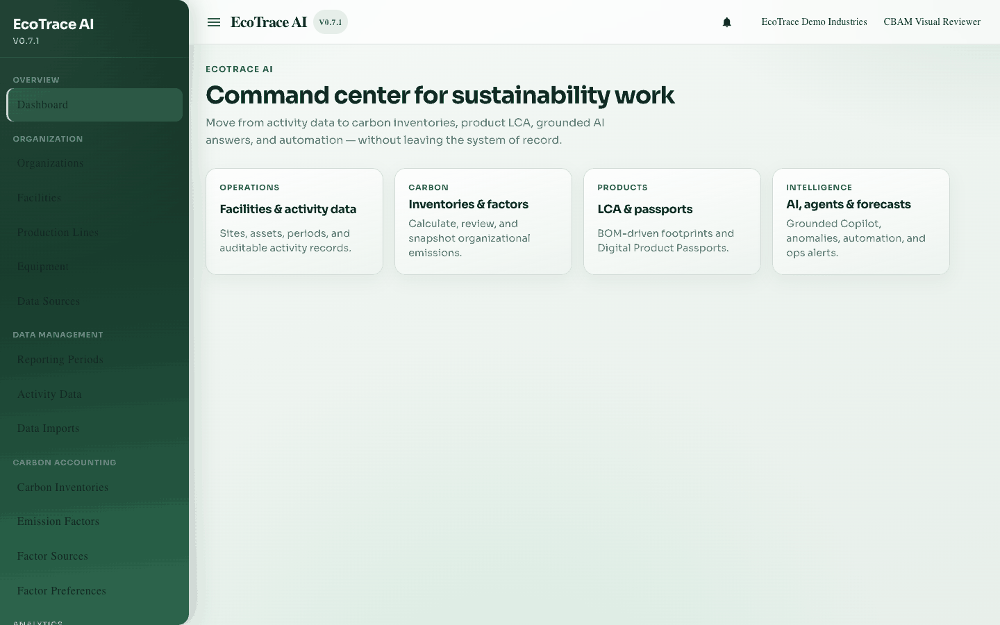
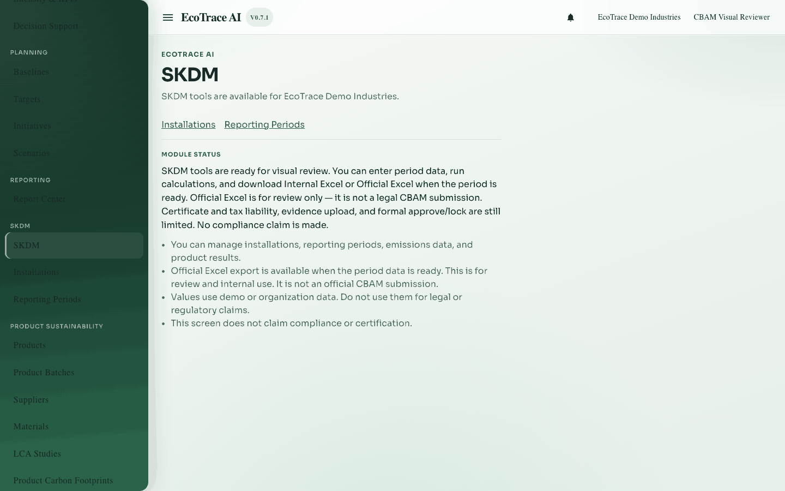

# 1. Getting started

**Previous:** [Guide home](README.md) · **Next:** [Organizations and installations](02-organizations-and-installations.md)

## Purpose

Sign in, open your organization, and reach the SKDM area for Carbon Border Adjustment Mechanism (CBAM), called SKDM in Turkish.

## Who can use it

Anyone with a valid EcoTrace account. To open CBAM screens you need **view** access. To change data you need **edit** access (configure).

## What must be completed first

- EcoTrace web app and API are running
- Your user belongs to an organization with CBAM access

## How to open

1. Open the web app.
2. Go to **Login**.
3. After login, open **Dashboard**.
4. Open **SKDM** from the app menu (Carbon Border Adjustment Mechanism / CBAM).

## Page sections

| Area | What you see |
|------|----------------|
| Login | Email and password |
| Dashboard | Shortcuts into modules |
| SKDM home | Short intro to the CBAM workflow |
| Navigation | Links to Installations and Periods |

## Field explanations (Login)

| Label | Required | Notes |
|-------|----------|-------|
| Email | Yes | Your account email |
| Password | Yes | Never share passwords in screenshots or docs |

## Step-by-step

1. Enter email and password.
2. Submit login.
3. Confirm your active organization (if the app asks you to choose).
4. Open **SKDM** → **Installations** or **Periods**.

## Common errors

| Message | Meaning | Fix |
|---------|---------|-----|
| Unauthorized / wrong credentials | Login failed | Check email/password; ask an admin to reset |
| You do not have permission | Missing CBAM access | Ask an admin for view or edit access |

## Where to go next

Create or open an [installation](02-organizations-and-installations.md), then a [reporting period](03-reporting-periods.md).

## Example

A local demo editor signs in, selects EcoTrace Demo Industries, then opens SKDM → Periods.

## Inventories

Field and action lists: [inventories/](inventories/).
