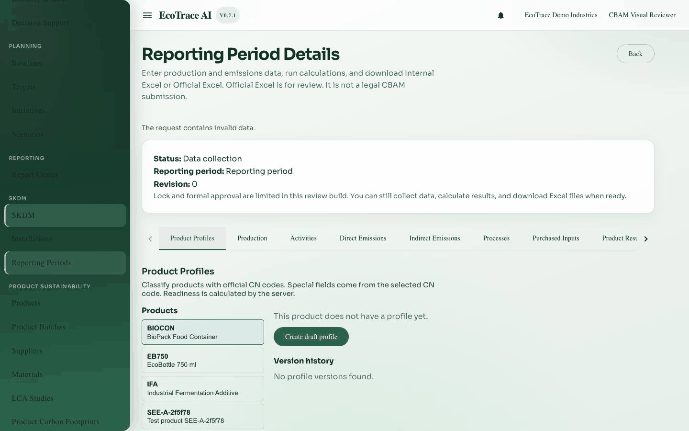

# 4. Product profiles

**Previous:** [Reporting periods](03-reporting-periods.md) · **Next:** [Production](05-production.md)

## Purpose

Classify each CBAM product with a CN code and steel details so production and later results know *what* you produce.

## Who can use it

View: **view** access. Create, publish, archive: **edit** access on a writable period.

## What must be completed first

- Open reporting period detail

## How to open

Period detail → tab **Product Profiles**.

## Sections

- Organization products list
- CN code search
- Profile draft editor
- Publish / new version / archive actions
- Classification readiness from the server

## Important fields

| Label | Required | Notes |
|-------|----------|-------|
| Profile name | Yes | Clear name for this version |
| CN code | Yes | Search the catalog; the code must exist |
| Reducing material | Conditional | Shown when the CN requires it |
| Steel mill ID | Conditional | Steel field when applicable |
| Manganese / Chromium / Nickel / Other alloys / Other materials % | Conditional | Steel special fields when applicable |
| Valid from / Valid to | As shown | Validity window for the profile version |

## Actions

| Action | Meaning |
|--------|---------|
| Save draft | Keeps an editable draft |
| Publish | Makes the version usable for production |
| New version | Starts a next version |
| Archive | Retires the version |

## Readiness

The server shows if classification is ready. New production needs an **active, ready** profile. Older production rows may show link status such as Ready / Outdated / Missing.

## Common errors

| Situation | Fix |
|-----------|-----|
| CN not found | Search another code that exists in the catalog |
| Cannot publish | Complete the required CN fields shown for that CN |
| Permission message | Need edit access and a writable period |

## Where to go next

[Production](05-production.md) — create production records linked to published profiles.

## Example

Publish profiles for CN `73181595` (screws) and `73181699` (nuts) with required steel fields.

## Inventories

Field and action lists: [inventories/](inventories/).
