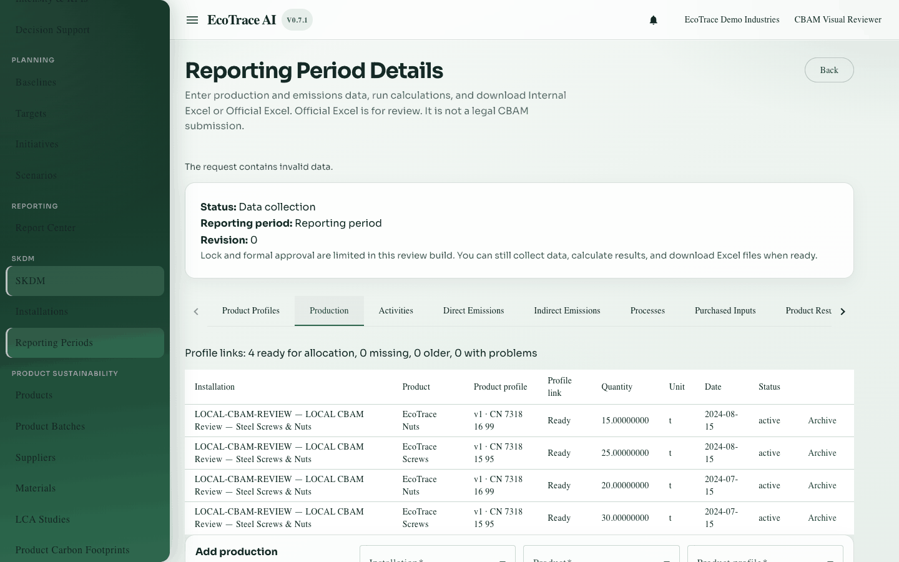
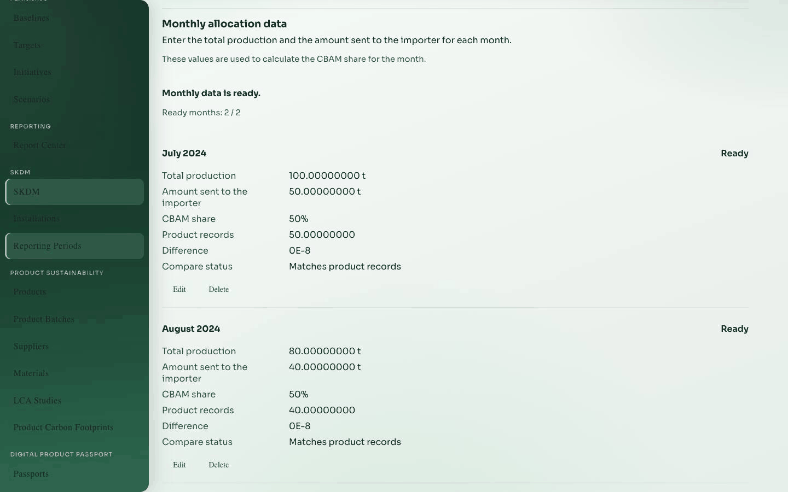

# 5. Production

**Previous:** [Product profiles](04-product-profiles.md) · **Next:** [Activities](06-activities.md)

## Purpose

Record how much product you produced in the period, and enter **monthly D and E** amounts used later for allocation.

## Who can use it

View: **view** access. Create, edit, archive: **edit** access on a writable period.

## How to open

Period detail → tab **Production**.

## Sections

1. Production records table and form  
2. **Monthly allocation data** (D and E by month)

## Production record fields

| Label | Required | Notes |
|-------|----------|-------|
| Product | Yes | Organization product |
| Product profile | Yes | Must be classification-ready for new rows |
| Installation | As shown | Usually the period installation |
| Quantity | Yes | Produced quantity |
| Unit | Yes | Mass unit expected by rules |
| Date | Yes | Date inside the reporting period |
| Notes | Optional | Free text |

### Production actions

- Save production  
- Archive  
- Link profile (for older rows missing a profile link)

## Monthly allocation data

Used later by direct and indirect **allocation**.

| Label | Meaning | Unit |
|-------|---------|------|
| Total production (D) | Monthly total production | tonnes |
| Amount sent to the importer (E) | Monthly CBAM-relevant quantity | tonnes |
| Unit | Unit shown for the row | usually t |

The system computes the share **E ÷ D** when D is greater than 0. Coverage and readiness come from the server — do not invent shares yourself.

### Monthly data actions

- Add or edit monthly rows  
- Delete a month row when allowed  
- Retry / Reload after errors

## Validation and readiness

- New production needs a ready profile.  
- Incomplete months block allocation readiness.  
- Warnings may appear if monthly totals disagree with production records.

## Where to go next

Enter fuel and electricity in [Activities](06-activities.md).

## Example

Add monthly D/E for July and August, then add production rows for screws and nuts linked to published profiles.

## Inventories

Field and action lists: [inventories/](inventories/).
