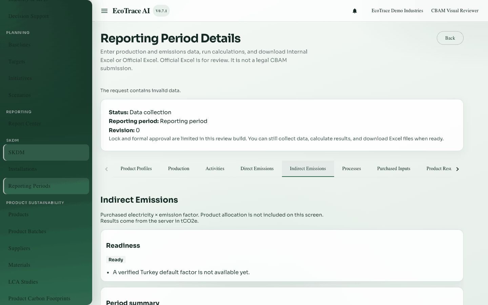

# 8. Indirect emissions (purchased electricity)

**Previous:** [Direct emissions](07-direct-emissions.md) · **Next:** [Processes](09-processes.md)

## Purpose

Calculate **indirect emissions** from purchased electricity: electricity × emission factor → tCO₂e.

## Who can use it

View: **view** access. Calculate: **edit** access on a writable period.

## What must be completed first

- Electricity activity records (kWh or MWh)

## How to open

Period detail → tab **Indirect Emissions**.

## Calculate fields

| Label | Required | Notes |
|-------|----------|-------|
| Electricity record | Yes | Eligible electricity activity |
| Factor value | Yes for manual | tCO₂e per MWh |
| Factor unit | Yes | Must match the method |
| Source name / document / dataset / reference / date | Yes for manual evidence | Shows where the factor comes from |
| Exported electricity | Optional | Stored separately; **not subtracted** from purchased electricity in this MVP |
| Unit / Evidence notes | As shown | Supporting detail |

### Factor sources

- **Manual** — you enter the factor and evidence (supported).  
- **Platform default** — only if a verified default exists. The product does **not** invent an unverified Turkey default.

## Business meaning

Purchased electricity (converted to MWh if needed) × factor = facility indirect emissions. Exported electricity is recorded separately for later process or export use and is not netted here.

## Status

Same pattern as direct emissions: Current / History / Out of date, with a readiness summary from the server.

## Common errors

| Situation | Fix |
|-----------|-----|
| Verified default missing | Use Manual factor with evidence |
| Permission / locked period | Edit access and a writable period |
| Bad unit | Use kWh or MWh as allowed |

## Where to go next

[Processes](09-processes.md), then [Allocation](12-allocation.md).

## Example

Select the kWh electricity activity, enter factor `0.439` with document evidence, calculate, confirm tCO₂e total.

## Inventories

Field and action lists: [inventories/](inventories/).
