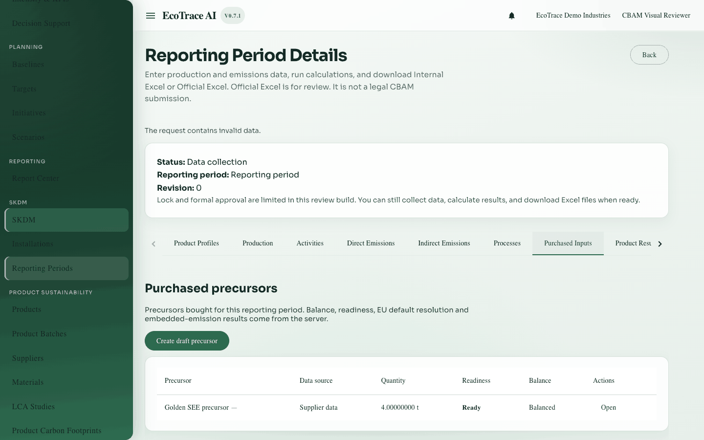
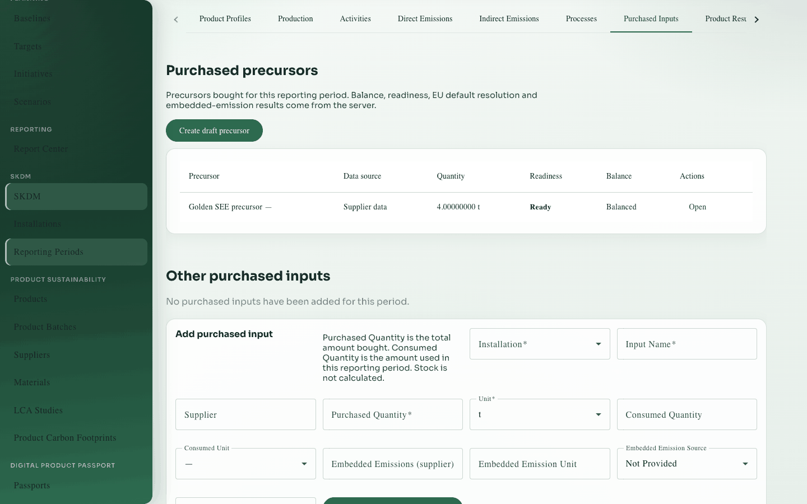

# 10. Purchased inputs and precursors

**Previous:** [Processes](09-processes.md) · **Next:** [Product results](11-product-results.md)

## Purpose

Record purchased goods that affect embedded emissions: generic purchased inputs, and **purchased precursors** with supplier data or EU default values.

## Who can use it

View: **view** access. Change data: **edit** access on a writable period.

## How to open

Period detail → tab **Purchased Inputs**.

## Section A — Purchased precursors

### Modes (exactly two)

| Mode | Meaning |
|------|---------|
| Supplier data | You enter supplier-specific embedded values |
| EU default | You search and pick a catalog default row; the saved copy does not change later |

**Hybrid mode is not supported.** Switching mode clears the other mode’s fields before save.

### Key fields

| Label | Notes |
|-------|-------|
| Installation / Precursor name / Identifier | Identity |
| Aggregated goods category | Classification |
| Purchased input record / Supplier | Links |
| CN code / Country of origin / Production route | Identity for defaults |
| Purchased quantity / Unit | Mass (converted to tonnes on the server when needed) |
| Specific direct embedded emissions + sources | Supplier mode |
| Electricity intensity / factor / sources | Supplier mode |
| EU default search + explicit row selection | Default mode (never auto-picks “Other countries” without opt-in) |

### Product uses

Distribute precursor tonnes to target product profiles (and non-CBAM). Unbalanced drafts may save; readiness blocks until balanced.

### Calculated displays

Specific and total embedded emissions for the precursor are **calculated by the server** and read-only.

## Section B — Generic purchased inputs table

Older/generic purchased-input rows with quantity, consumed quantity, embedded emissions fields, and archive actions. Still available on the same tab.

## Where to go next

[Product results](11-product-results.md) to combine everything.

## Example

Add precursor “Wire rod” with EU default for the CN/country, assign tonnes to the screw profile until remaining is 0.

## Inventories

Field and action lists: [inventories/](inventories/).
