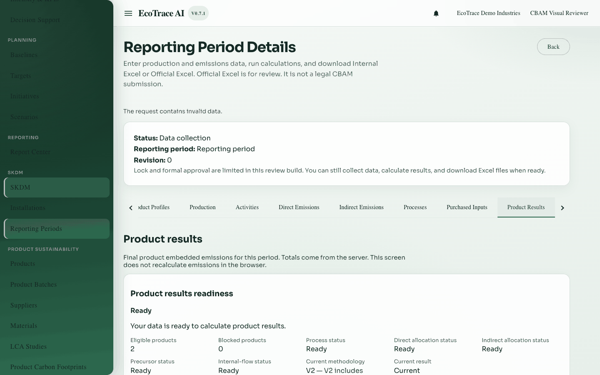

# 11. Product results (embedded emissions)

**Previous:** [Purchased inputs and precursors](10-purchased-inputs-and-precursors.md) · **Next:** [Allocation](12-allocation.md)

## Purpose

Run **Product Embedded Emissions (version 2)** to combine direct allocation, indirect allocation, process heat/waste gas, precursors, internal product flows, and process exported electricity into product-level results.

## Who can use it

View: **view** access. Calculate: **edit** access on a writable period.

## What must be completed first

Readiness is decided by the server. Typical blockers:

- Missing or out-of-date direct or indirect allocation  
- Unready processes or unbalanced distributions  
- Unready precursors  

Follow the links shown in the readiness panel.

## How to open

Period detail → tab **Product Results**.

## Actions

| Action | Meaning |
|--------|---------|
| Calculate / Calculate again / Update | New saved version-2 result |
| Open history / detail | Inspect product rows and breakdowns |
| Retry | Reload after errors |

There is **no methodology picker** in the UI; version 2 is the default path.

## What you see after success

- Product table with absolute and specific embedded emissions  
- Breakdown: own process, precursors, internal flows, exported electricity effect  
- Current / History / Out of date badges  

All numbers come from the saved result — the screen does not recalculate emissions locally.

## Where to go next

Confirm allocations on [Allocation](12-allocation.md) if readiness asked for them, then [Report / Official Excel](14-report-and-official-excel.md).

## Example

When readiness is Ready, calculate version 2, open the current result, verify screw and nut specific tCO₂e/t.

## Inventories

Field and action lists: [inventories/](inventories/).
