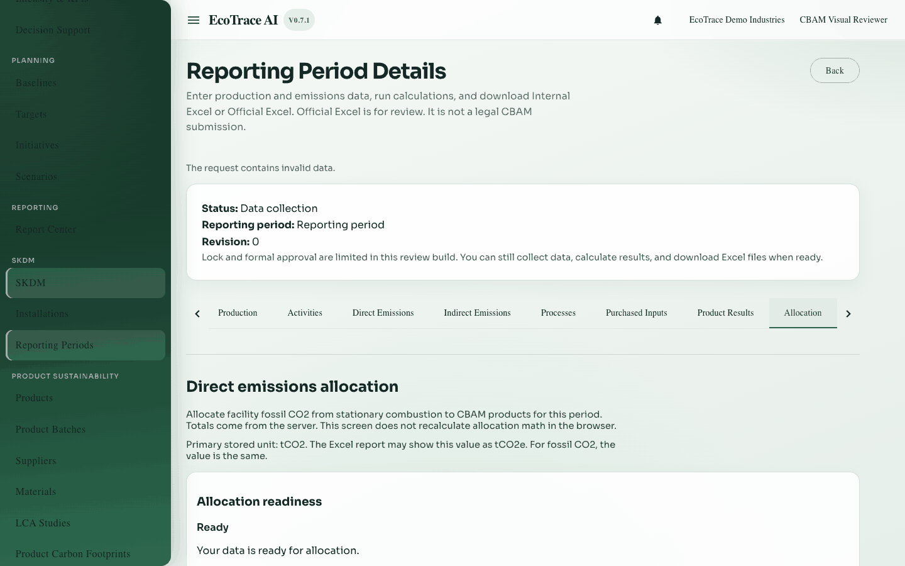
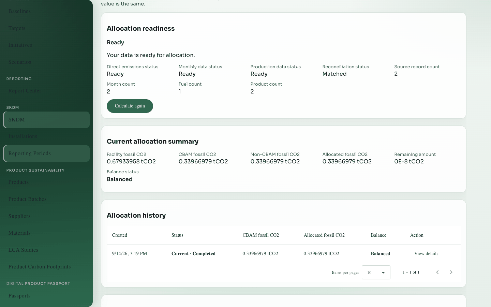
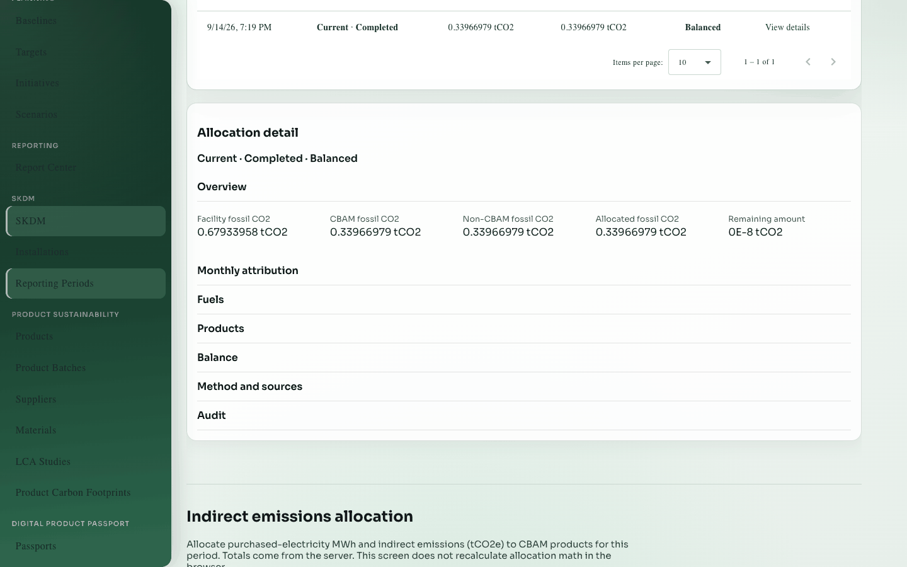

# 12. Allocation

**Previous:** [Product results](11-product-results.md) · **Next:** [Factors and calculations](13-factors-and-calculations.md)

## Purpose

Share facility-level emissions (and electricity) across CBAM products using monthly production basis D/E and product quantities.

## Who can use it

View: **view** access. Calculate allocations: **edit** access on a writable period.

## How to open

Period detail → tab **Allocation**.

## Section 1 — Direct emissions allocation

Allocates current stationary-combustion fossil CO₂ to products.

### Prerequisites

- Monthly D/E complete enough for readiness  
- Current direct emissions results  

### Actions

Calculate / Calculate again / Update · view summary · history · detail · Retry

### Outputs

Product allocation rows in **tCO₂**, current marker, and reasons when results become out of date after inputs change.

## Section 2 — Indirect emissions allocation

Allocates purchased-electricity MWh and tCO₂e to products. Exported electricity remains separate (not allocated as a deduction).

## Section 3 — Generic allocation rules (still active)

Older/generic rules for assigning activity or purchased-input amounts with methods such as:

- Direct assignment  
- Production quantity ratio  
- Manual ratio  

| Fields (examples) | Notes |
|-------------------|-------|
| Method, Name, Description | Rule identity |
| Target Production / Total Base Production / Allocation Ratio | Method-specific |
| Activate / Archive / Allocate / Recalculate | Lifecycle |

Prefer the dedicated Direct/Indirect allocation sections for the modern fuel + electricity path. Generic rules remain for earlier workflow pieces (Factors / Calculation / Internal Excel).

## Monthly D/E reminder

Enter months under [Production](05-production.md). Allocation does not invent missing months.

## Where to go next

[Factors and calculations](13-factors-and-calculations.md) for generic factor resolution, or jump to [Official Excel](14-report-and-official-excel.md) when Product Results are ready.

## Example

After fuel and electricity currents exist and D/E months are filled, run Direct emissions allocation then Indirect emissions allocation until both show Current and Ready.

## Inventories

Field and action lists: [inventories/](inventories/).
