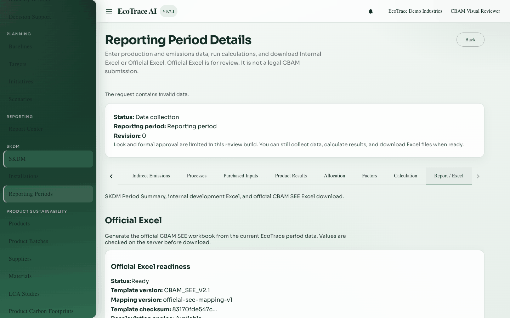
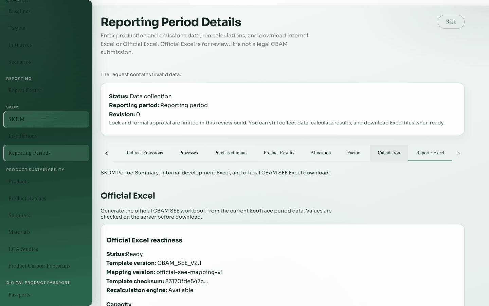
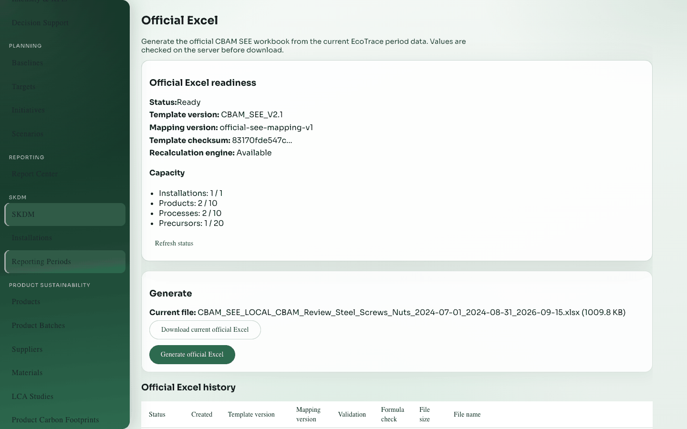
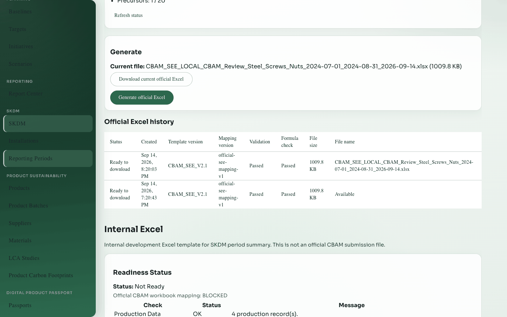
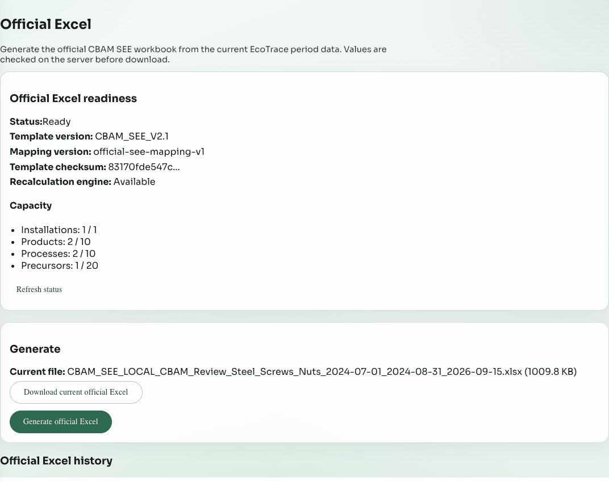

# 14. Report and Official Excel

**Previous:** [Factors and calculations](13-factors-and-calculations.md) · **Next:** [Permissions, statuses, and errors](15-permissions-statuses-and-errors.md)

## Purpose

Generate exports:

1. **Official Excel** — fills **CBAM SEE** (the official workbook used for emissions communication) from validated Product Results (version 2), recalculates formulas, then allows download. After this definition, use **Official Excel** for the EcoTrace screen and actions.  
2. **Internal Excel** — separate internal workbook export (not the Official Excel / CBAM SEE file).

## Who can use it

- View readiness, history, and download of valid files: **view** access  
- Generate Official / Internal exports: **edit** access on a writable period  

## How to open

Period detail → tab **Report / Excel**.

## Official Excel section

### Readiness

Server checklist. Typical needs: current product embedded emissions (version 2), capacity within template limits, known template/mapping versions.

### Generate

Editors start a run. States include processing, completed, failed.

### Validation pipeline (plain language)

1. Build workbook from the template mapping  
2. Recalculate formulas on the API host (needs LibreOffice where Official Excel is required)  
3. Check formula errors and match with database results  
4. Check that example data did not leak into the file  
5. Only then publish a file you can download  

If any check fails, the run fails and a previous successful file can remain available.

### Download

Signed-in download of the validated file with a safe filename. Download stays blocked until validation passes.

### History

Past runs with status. Failed runs show safe messages (not technical stack traces).

## Internal Excel section

Separate export readiness, generate, file list, and download for the internal SKDM template. This is **not** the Official Excel file.

## Capacity and limitations

- Template slot/process limits apply (see readiness errors).  
- Biogenic carbon, tax, Process Emissions method, Mass Balance method, and hybrid precursors are out of scope.  
- Official Excel needs LibreOffice on the API host. The supported Docker API image installs **Document Foundation LibreOffice 26.8** (not the older Debian package). If LibreOffice is missing or too old, readiness stays blocked until the correct engine is available.

## Common errors

| Situation | Fix |
|-----------|-----|
| Not ready | Follow readiness links (often Product Results / allocation / processes) |
| LibreOffice unavailable | Admin must use the LibreOffice 26.8 API image (or install matching `soffice`) |
| Formula check failure | Fix source results; recalculate product results; generate again |
| Edit permission required | Ask for edit (configure) access |
| Locked period | Cannot generate; view/download only if a file already exists |

## Where to go next

[Permissions, statuses, and errors](15-permissions-statuses-and-errors.md) or the [complete workflow](16-complete-example-workflow.md).

## Example

When Official readiness is Ready, generate, wait until Completed, download the `.xlsx`, and keep the file hash from history if your process requires it.

## Inventories

Field and action lists: [inventories/](inventories/).
