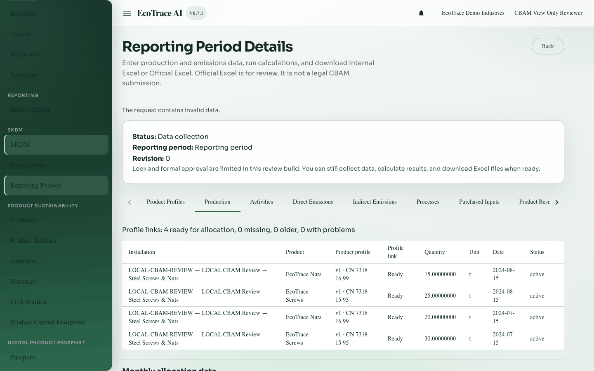
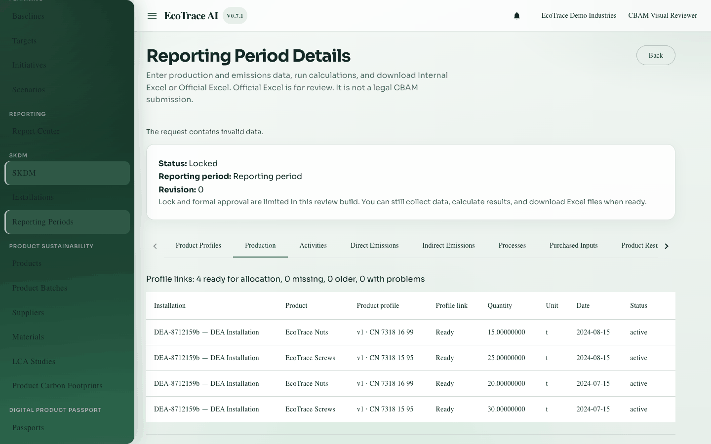
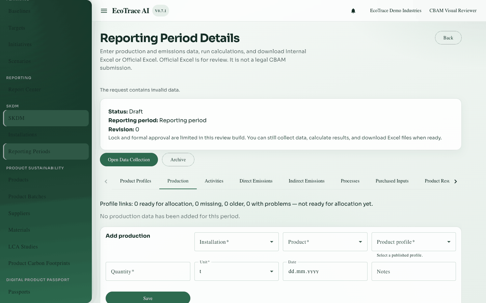
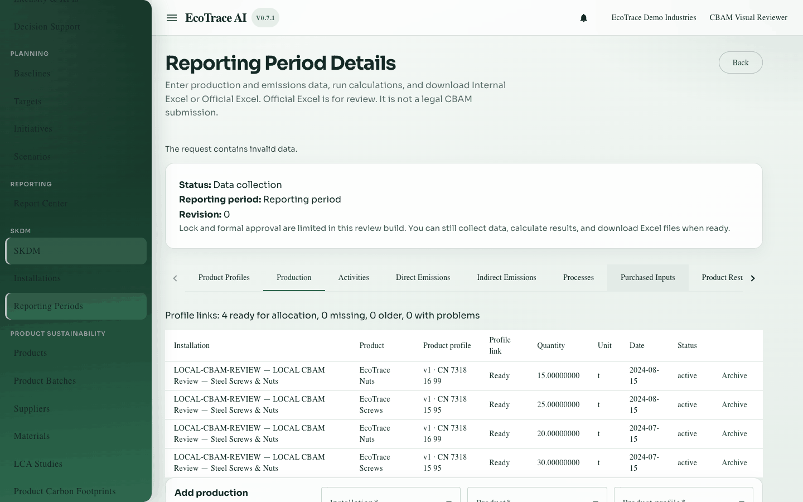
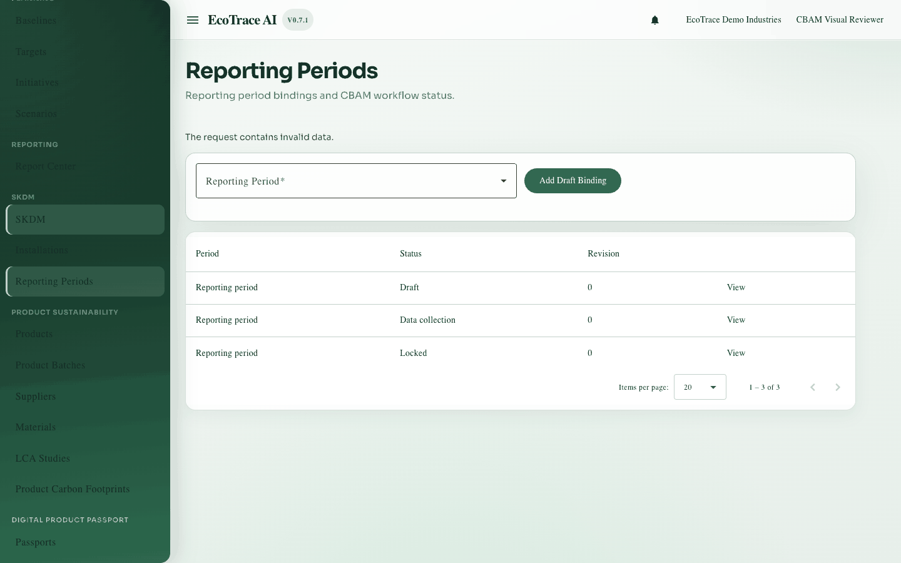
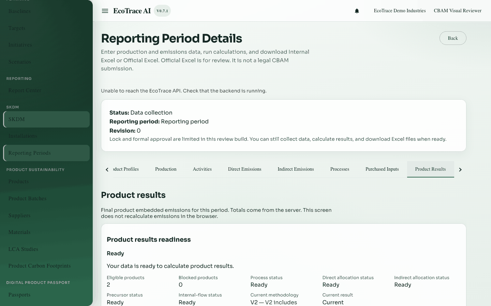
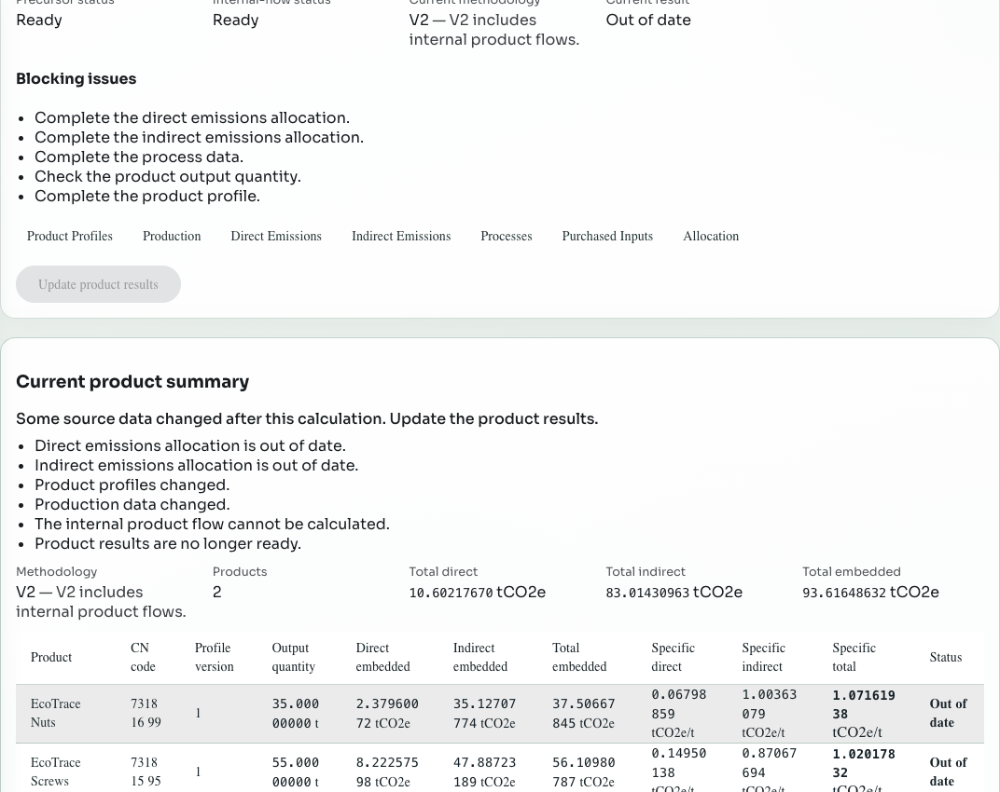
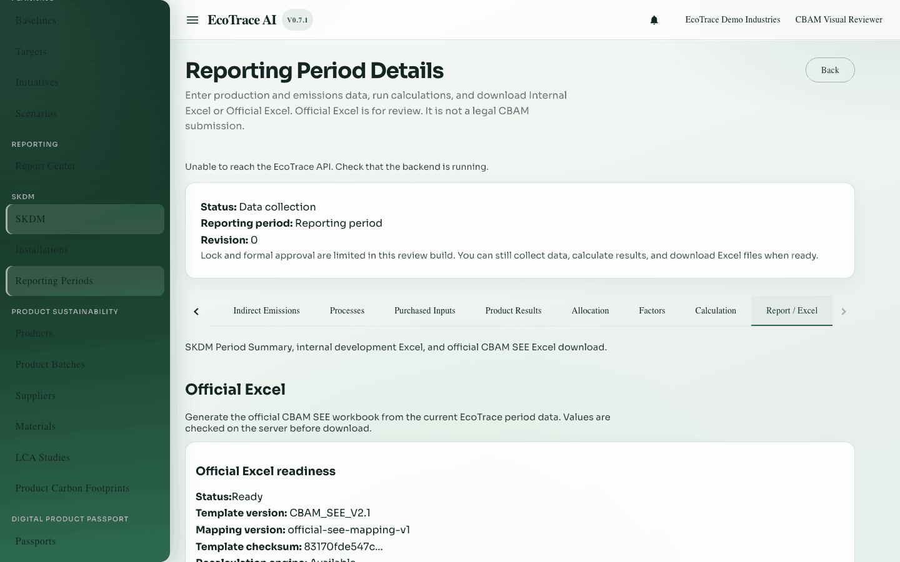

# 15. Permissions, statuses, and errors

**Previous:** [Report and Official Excel](14-report-and-official-excel.md) · **Next:** [Complete example workflow](16-complete-example-workflow.md)

## Permissions

| Access | Meaning |
|--------|---------|
| View | Open SKDM screens, see data, download valid Official Excel files |
| Edit (configure) | Create/edit/archive, calculate, allocate, generate exports |

### Matrix (summary)

| Screen / action | View | Edit | Locked period |
|-----------------|------|------|---------------|
| Open period tabs | Yes | Yes | Yes (read) |
| Create/edit data | No | Yes | No |
| Calculate / allocate / generate | No | Yes | No |
| Download valid Official Excel | Yes | Yes | Yes if a file exists |

## Status vocabulary (used in UI)

| Status | Typical place | User meaning | Blocking? |
|--------|---------------|--------------|-----------|
| Draft | Period / profiles / processes / precursors | Editable, not finished | Often blocks readiness |
| Data collection | Period | Normal entry window | No |
| Locked | Period | No writes | Yes for changes |
| Archived | Many places | Retired | Yes for reuse |
| Ready / Not Ready / Ready with Warnings | Readiness panels | Can or cannot run next step | Yes if Not Ready |
| Current | Results | Active result | — |
| History | Results | Older run | — |
| Out of date | Results | Recalculate | Yes for export if the required current result is out of date |
| Failed | Runs | Did not complete | Yes until fixed |
| Completed | Export runs | Finished successfully | — |
| Unbalanced | Processes / precursors | Remaining is not zero | Blocks readiness |
| Empty / Incomplete | Precursor readiness | Missing data | Blocks readiness |
| Missing / Outdated / Invalid | Production profile links | Fix profile link | Can block new writes |
| Superseded | Profile versions | Replaced by a newer version | Historical rows may still reference it |

Only statuses you actually see in the UI matter for daily work.

## Value kinds (business)

| Kind | Meaning |
|------|---------|
| User input | You typed or selected it |
| Platform default | Catalog/system value |
| Manual override | Explicit user factor/value |
| Calculated | Server math |
| Allocated | Shared from facility to products |
| Snapshot | Frozen copy inside a result |
| Current vs history | Active marker vs older saved rows |

## Common errors (cross-cutting)

| Message shown | Likely cause | User action |
|---------------|--------------|-------------|
| You do not have permission to do this. | Missing edit/view access | Ask admin |
| Configure permission is required… | Generate without edit access | Ask admin |
| Period is locked / cannot change | Locked period | Use another period or follow unlock process |
| Conflict / someone else saved | Concurrent edit | Reload and retry |
| Repeat request conflict | Same generate/calculate request reused wrongly | Start a new calculate/generate |
| Not found | Wrong organization/period or no access | Check selection |
| Network/server problem | API down | Retry later |

See also chapter-specific errors in Direct/Indirect/Product Results/Official Excel chapters.

## Inventories

Field and action lists: [inventories/](inventories/).
