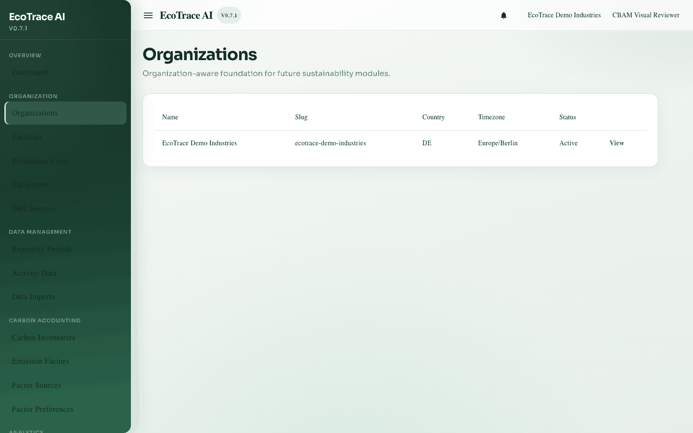
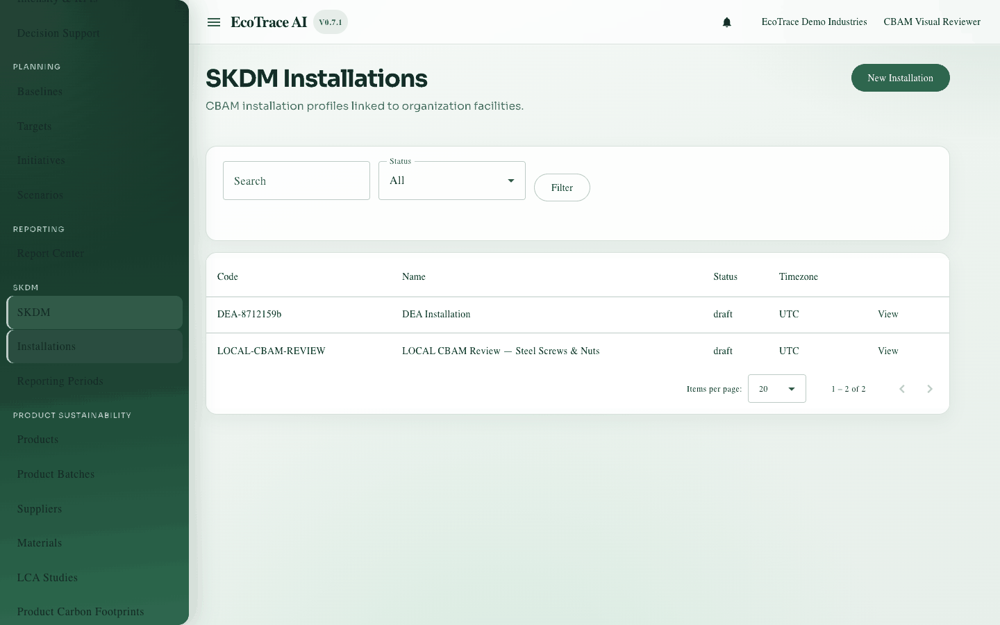
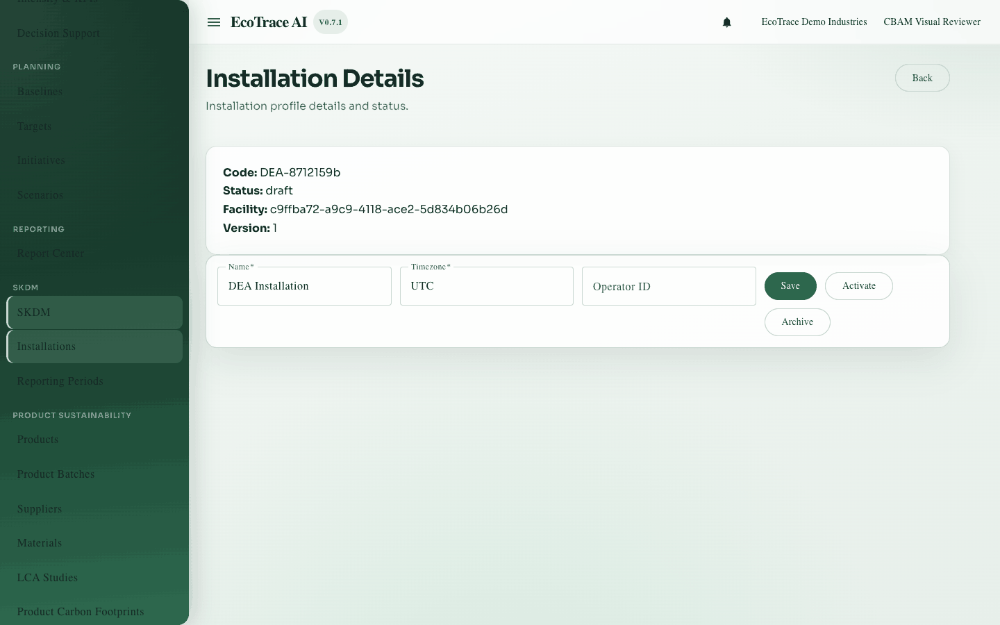
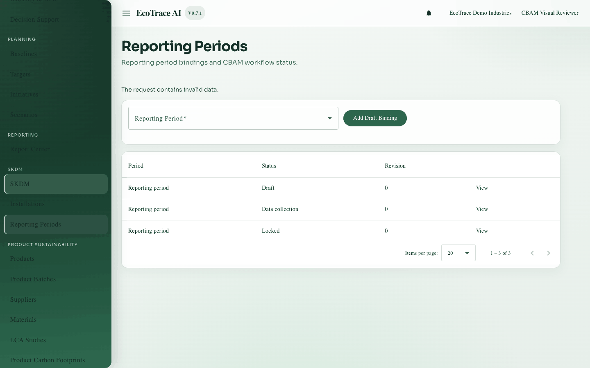
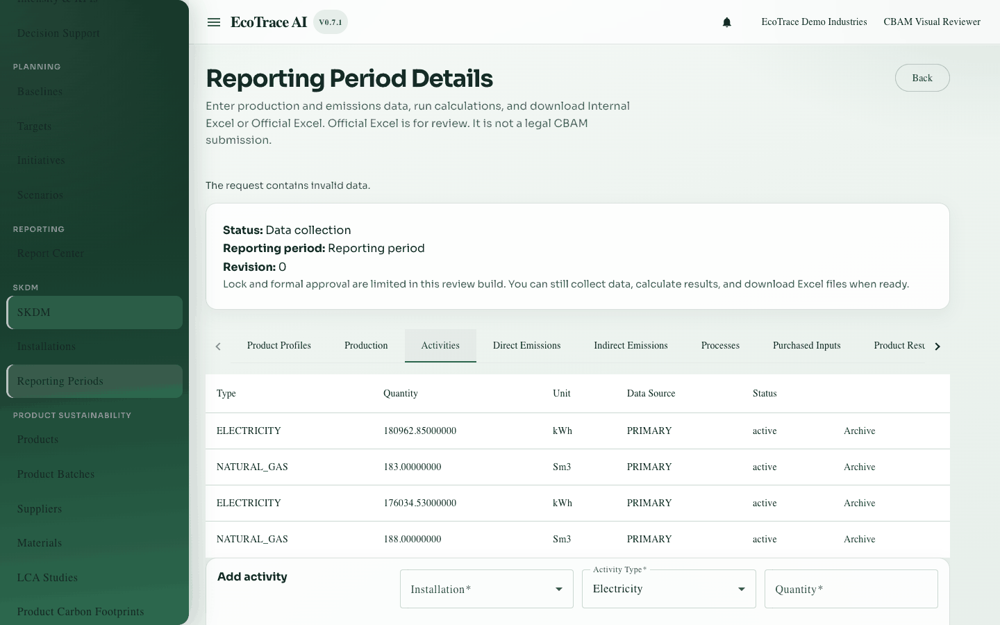
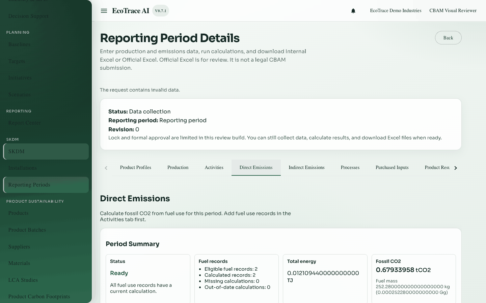
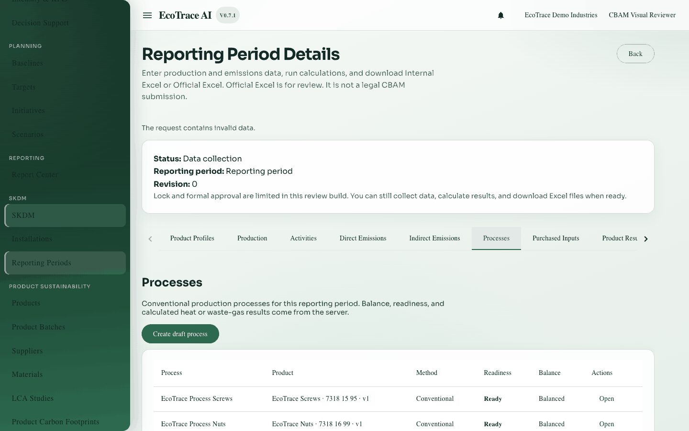
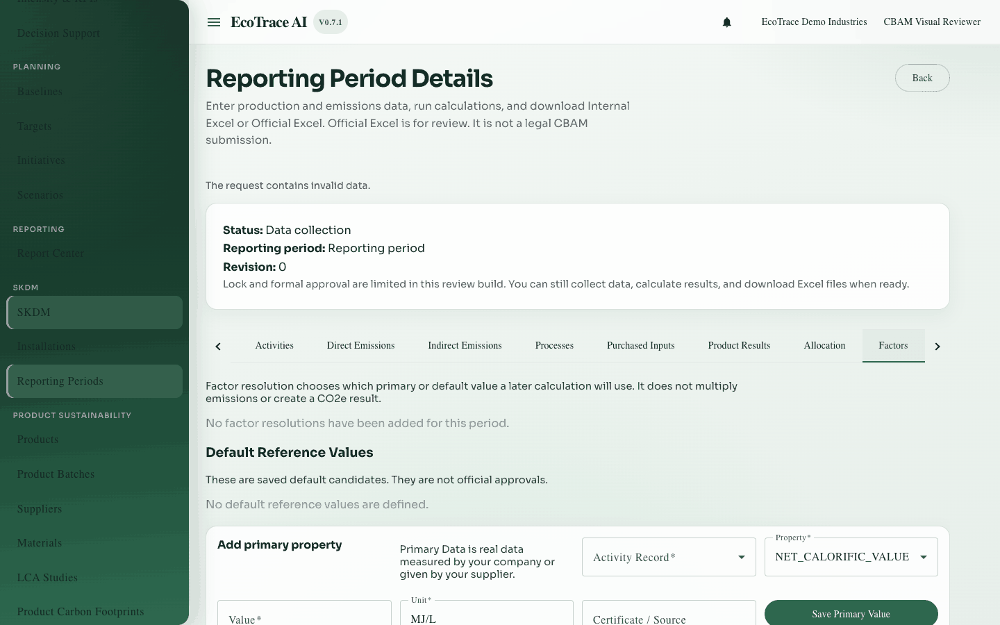
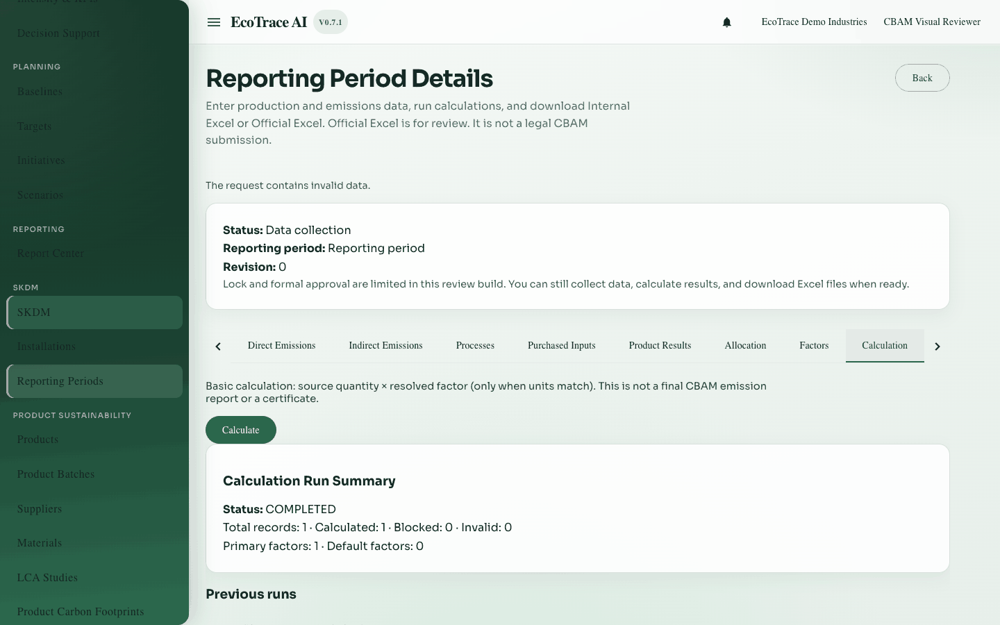

# EcoTrace AI — CBAM / SKDM User Guide

**Status: COMPLETE** (see [coverage report](../user-guide-coverage-report.md))  
**Audience:** sustainability analysts and reviewers who prepare Carbon Border Adjustment Mechanism (CBAM), called SKDM in Turkish, period data  
**Language:** English (A2–B1)  
**Source of truth:** current Angular + FastAPI implementation (not older phase proposals)  
**Classification:** MVP documentation — not a claim of regulatory or submission readiness

**CBAM SEE** is the official workbook used for emissions communication. In EcoTrace, the **Official Excel** screen fills that workbook from validated period results. In the product UI, the module title may show **SKDM**. Routes and APIs use `cbam`. After these definitions, this guide uses **Official Excel** for user steps and **SKDM** when matching on-screen menu labels. See the [Glossary](glossary.md).

## Screenshots (real app captures)

Demo data only. Alt text is on each image below and in [assets/README.md](assets/README.md).

| Screen | Image |
|--------|-------|
| Sign in |  |
| Dashboard |  |
| SKDM home |  |
| Organizations |  |
| Installations |  |
| Installation detail |  |
| Reporting periods |  |
| Period detail |  |
| Product Profiles |  |
| Production |  |
| Monthly allocation data |  |
| Activities |  |
| Direct Emissions |  |
| Indirect Emissions |  |
| Processes |  |
| Purchased Inputs |  |
| Purchased Precursors |  |
| Product Results |  |
| Allocation |  |
| Direct emissions allocation |  |
| Indirect emissions allocation |  |
| Factors |  |
| Calculation |  |
| Report / Excel |  |
| Official Excel readiness |  |
| Official Excel history |  |
| Internal Excel |  |
| Official Excel completed download |  |
| Empty period |  |
| View-only period |  |
| Locked state |  |

## How to use this guide

1. Start with [Getting started](01-getting-started.md).
2. Follow the screens in order, or jump from the table below.
3. Use [Complete example workflow](16-complete-example-workflow.md) for an end-to-end walkthrough.
4. Field / action / API inventories: [inventories/](inventories/) · language audit: [inventories/a2-b1-language-audit.md](inventories/a2-b1-language-audit.md).
5. Developers: [Technical UI→data traceability](../technical-ui-data-traceability.md) and [Data relationships & lifecycle](../data-relationships-and-lifecycle.md).

## Demo scenario used in examples

| Item | Demo value |
|------|------------|
| Organization | EcoTrace Demo Industries |
| Installation | LOCAL CBAM Review — Steel Screws & Nuts |
| Period | Review period covering steel screw/nut production |
| Products | Steel screws and nuts with CN codes in the catalog |
| Fuels | Natural gas (stationary combustion) |
| Electricity | Purchased electricity with an explicit factor and evidence |

Use only local demo data. Do not paste real customer data into documentation.

## Screen map (reachable)

| Screen | Route / place | Guide chapter |
|--------|---------------|---------------|
| Login | `/login` | [01](01-getting-started.md) |
| Dashboard / nav | `/app/dashboard` | [01](01-getting-started.md) |
| Organizations | `/app/organizations` | [02](02-organizations-and-installations.md) |
| SKDM shell | `/app/cbam` | [01](01-getting-started.md) |
| Installations list | `/app/cbam/installations` | [02](02-organizations-and-installations.md) |
| New installation | `/app/cbam/installations/new` | [02](02-organizations-and-installations.md) |
| Installation detail | `/app/cbam/installations/:id` | [02](02-organizations-and-installations.md) |
| Reporting periods | `/app/cbam/periods` | [03](03-reporting-periods.md) |
| Period detail (hub) | `/app/cbam/periods/:bindingId` | [03](03-reporting-periods.md) |
| Product Profiles tab | Period detail | [04](04-product-profiles.md) |
| Production tab | Period detail | [05](05-production.md) |
| Monthly allocation data | Inside Production | [05](05-production.md) / [12](12-allocation.md) |
| Activities tab | Period detail | [06](06-activities.md) |
| Direct Emissions tab | Period detail | [07](07-direct-emissions.md) |
| Indirect Emissions tab | Period detail | [08](08-indirect-emissions.md) |
| Processes tab | Period detail | [09](09-processes.md) |
| Purchased Inputs tab | Period detail | [10](10-purchased-inputs-and-precursors.md) |
| Purchased precursors | Inside Purchased Inputs | [10](10-purchased-inputs-and-precursors.md) |
| Product Results tab | Period detail | [11](11-product-results.md) |
| Allocation tab | Period detail | [12](12-allocation.md) |
| Factors tab | Period detail | [13](13-factors-and-calculations.md) |
| Calculation tab | Period detail | [13](13-factors-and-calculations.md) |
| Report / Excel tab | Period detail | [14](14-report-and-official-excel.md) |
| Official Excel section | Inside Report / Excel | [14](14-report-and-official-excel.md) |
| Permissions & errors | — | [15](15-permissions-statuses-and-errors.md) |

## Chapters

1. [Getting started](01-getting-started.md)
2. [Organizations and installations](02-organizations-and-installations.md)
3. [Reporting periods](03-reporting-periods.md)
4. [Product profiles](04-product-profiles.md)
5. [Production](05-production.md)
6. [Activities](06-activities.md)
7. [Direct emissions](07-direct-emissions.md)
8. [Indirect emissions](08-indirect-emissions.md)
9. [Processes](09-processes.md)
10. [Purchased inputs and precursors](10-purchased-inputs-and-precursors.md)
11. [Product results](11-product-results.md)
12. [Allocation](12-allocation.md)
13. [Factors and calculations](13-factors-and-calculations.md)
14. [Report and Official Excel](14-report-and-official-excel.md)
15. [Permissions, statuses, and errors](15-permissions-statuses-and-errors.md)
16. [Complete example workflow](16-complete-example-workflow.md)
17. [Glossary](glossary.md)

## Related technical docs

- [Coverage & verification report](../user-guide-coverage-report.md)
- [Technical UI→data traceability](../technical-ui-data-traceability.md)
- [Data relationships and lifecycle](../data-relationships-and-lifecycle.md)
- [Current MVP scope](../current-scope.md)
- [Official SEE export (technical)](../official-see-export.md)
- [Inventories](inventories/) · [A2–B1 language audit](inventories/a2-b1-language-audit.md) · [LibreOffice macOS codesign](inventories/libreoffice-macos-codesign.md)

## Screenshot note

Screenshots live under [`assets/`](assets/). Distinct evidence is required for Official Excel history, completed download, unbalanced, and stale states.
