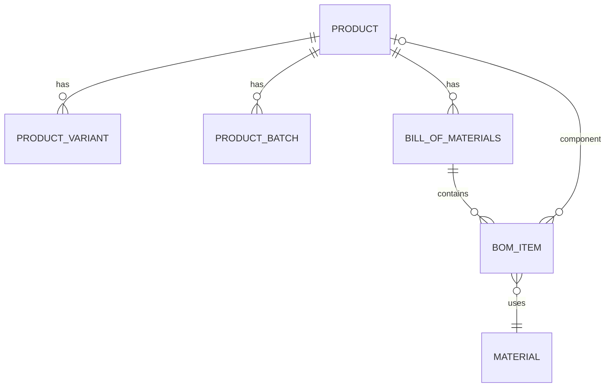
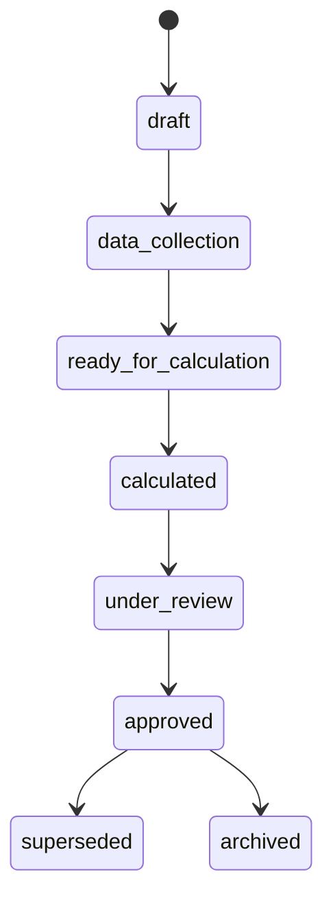
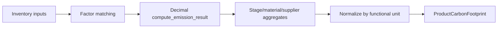
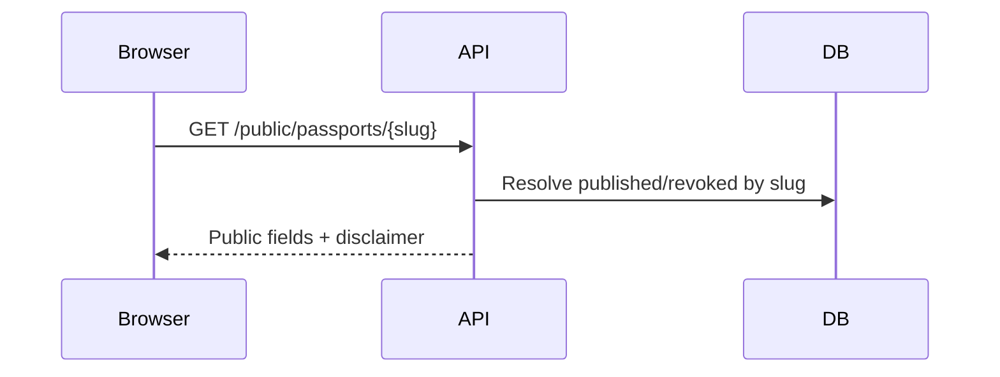

# Phase 5 — Life Cycle Assessment, Product Carbon Footprint, and Digital Product Passport

EcoTrace AI v0.5.0 adds the product sustainability layer.

## Architecture

Modular monolith modules:

- `products` — products, variants, batches, BOM, indicators
- `suppliers` / `materials`
- `lifecycle_assessment` — studies, functional units, boundaries, inventory, runs/items, DQ
- `product_carbon_footprint`
- `digital_product_passport` — sections, documents, QR, public views

Calculation logic lives in application services (`calculation_engine.py`), not routers or Angular.

## Product and BOM

- Product codes unique per organization; archive instead of hard delete.
- BOM versions are immutable once approved; clone creates a new draft version.
- Component product cycles are rejected.

## LCA study lifecycle

## Functional unit

One primary functional unit per study. Quantity must be positive. Changing the functional unit after calculation returns the study to data collection for draft invalidation.

## System boundary

Included stages must match study type (e.g. cradle-to-gate excludes use/EoL stages). Exclusions require a reason.

## Allocation

Methods: mass, energy, economic, physical, custom, none.

- Economic allocation requires currency metadata.
- Custom allocation requires `allocationReason`.
- Factor must be in [0, 1]; invalid values are not silently normalized.

## Product carbon footprint methodology

Canonical formula:

`productCarbonFootprint = sum(allocated input emissions) / functionalUnitQuantity`

- Decimal only
- Reuses `match_emission_factor` and `compute_emission_result`
- Preserves factor/GWP/allocation snapshots on calculation items
- Climate change (kgCO2e) only; other impact categories are extension points and are not shown as zero

## Data quality

Internal 1–5 scores for temporal, geographic, technological, completeness, reliability. Overall = arithmetic mean. Not a certified pedigree matrix.

## Passport versioning and public/private strategy

- Stable public slug resolves to the active published (or revoked) passport.
- On publish, previous slug holders are renamed (`{slug}-v{n}`) then superseded to keep uniqueness.
- Published versions are immutable; changes require clone.
- Public endpoints expose only public sections and approved footprint summaries.
- Private supplier contacts, cost data, unpublished inventory, and storage paths are never public.

## QR strategy

Backend generates SVG QR via `segno` for the public URL (`/passport/{slug}`). QR endpoints do not expose private passport fields.

## Security

- Organization-scoped queries
- RBAC: write/manage/approve/publish helpers
- Mass-assignment of approval/publication fields blocked by dedicated action endpoints
- File uploads validated (size, MIME, path traversal)

## CSV imports

Import patterns for materials/suppliers/BOM/inventory reuse Phase 2 conventions; row-level validation without silent invalid imports. Full CSV UI may be expanded later; API validation patterns are in place for product domain creates.

## Known limitations

- Synchronous LCA calculation only (no Celery/Redis)
- Climate change impact only
- Demo factors/seed values are not authoritative
- Frontend LCA stepper is simplified; full 10-step editor is API-complete with essential Angular screens
- Public passport rate limiting is a production requirement if not already fronted by gateway

## Phase 6 readiness

Clean application services expose products, LCA results, footprints, passports, targets, and analytics as structured context for future AI Copilot/RAG without implementing those features now.

> Note: Phase 7 completed the platform (v0.7.1). See docs/phase-7.md and docs/final-system-overview.md.
